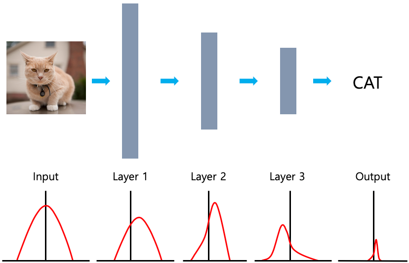
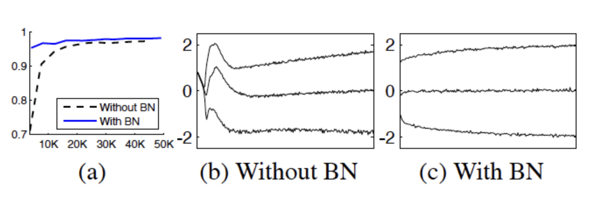

# 2015_Batch Normalization : Accelerating Deep Network Training by Reducing `Internal Covariate Shift`

### 링크
https://arxiv.org/abs/1502.03167

### 요약
제목에서도 알 수 있듯이, `Internal Covariate Shift` 를 줄이며 딥러닝 모델의 성능 향상 및 속도개선을 위해 고안된 방법론이다.

`Internal Covariate Shift`란, 위 그림과 같이 모델이 Input과 Output의 분포에 차이가 생긴다는 것을 의미한다.

즉, 데이터가 Layer를 거칠때마다 각 Layer는 Covariate Shift가 발생하여

다음 Layer로 전이가 되면서 층이 깊어질수록 Input과 Output간의 차이가 커지는 과정이 `Internal Covariate Shift`이다.

- Batch Normalization의 기본 아이디어는 위와 같은 `Internal Covariate Shift`를 해결하기 위함이다.
- Mini-Batch 단위로 각 층마다의 입력 값을 정규화를 진행합니다.

아래그림처럼 각 계층을 입력받기 전에 Batch-Normalization Layer를 추가적으로 생성한다.

이 때, Batch-Normalization의 알고리즘은 미니배치단위로 진행되며 아래와 같습니다.

Batch Normalization 에서는 `각 층마다 적정한 평균과 분산을 보정`해주기 위해서

Scale Factor : 감마(γ) Shift Factor : 베타(β)	를 별도로 구성합니다.

--- 
##### &#10004; TEST 과정에서의 평균과 분산 구하기

또한, __Test 과정__ 에서는 보통 Sample 한개씩 처리합니다.

이 때문에, 학습할 때 처럼 배치단위의 평균과 분산을 계산되지 않습니다.

이러한 이유로, Test과정에서는 우리는 평균과 분산의 __추정치__ 를 구해야 합니다.

> 이 때, 추정치로는 미리 저장해둔 Training Set의 n개의 평균과 분산을 `이동평균`을 사용하여 해결합니다.

---
### 실험
(1) MNIAT dataset :  - 간단한 레이어로 구성된 모델로 실험

미니 배치당 60개의 sample을 활용하여 50000 step 학습 한 결과 위와 같음.

- 더 빠른 속도로 높은 성능에 수렴하는 것을 보인다.
- 배치정규화된 네트워크가 정확도가 높다.
- 원래의 네트워크(b)에 비해 배치정규화를 적용한 (c)의 분포가 훨씬 더 안정적이다.
  - 이는 학습이 진행될수록 더 좋은 결과를 초래한다.

---
  
(2) ImageNet classification

|model| description |
|---|-------------|
|Inception|Inception Network 베이스라인 모델이다. Learning Rate는 0.0015|
|BN-Baseline|위의 Inception과 동일하지만 Nonlinearity에 들어가기 전에 Batch Normalization을 적용한 모델|
|BN-x5|위의 베이스라인 모델과 같지만 Learning Rate를 5배인 0.0075를 사용한 모델|
|BN-x30|마찬가지로 Learning Rate를 30배로 사용한 모델|
|BN-x5-Sigmoid|BN-x5와 동일하지만 Nonlinearity를 ReLU 대신 Sigmoid를 사용한 모델|

위는 다음과 같은 5개의 모델을 비교해본 것이다.

> __결론은, 배치정규화를 사용하면 Learning Rate가 높아도 수렴도 빨라지며, 성능또한 보장이 된다는 것이다.__

### Batch-Normalization 의 장점 및 효과
- Internal Covariate shift문제로 인해 신경망이 깊어질 경우 학습이 어려웠던 문제 해결
- gradient의 스케일과 초기값에 대한 dependency가 줄어들었음
  - 이로 인해, 높은 Learning Rate를 설정하거나 gradeint가 Vanish/expolce 현상 잦아듦
  - 또한 위 이유로 인해 학습속도 또한 상당히 빨라짐
- 배치정규화 자체적으로 regularization 효과가 있어 dropout의 기능또한 충분히 수행함

### 개정 내역

| 버전  | 작성자 | 작성일        | 내용                     |
|-----|-----|------------|------------------------|
| 0.1 | 박병현 | 2022.02.20 | 초안 작성 및 템플릿 작성 시작      |
| 0.2 | 박병현 | 2022.03.02 | summary markdown 작성 완료 |