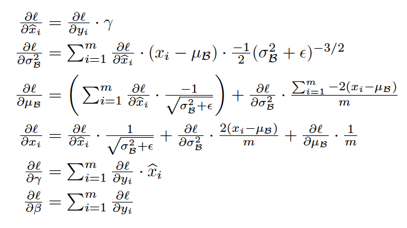

## 1. 구현 Summary
- 본 논문(BatchNormalization)은 Survey 논문으로, 구현 Summary는 작성하지 않음

## 2. 내용 Summary
Batch Normalization의 기본 아이디어는 각 층마다의 입력 값을 Mini-Batch 단위로

정규화하는 것에 있습니다.

해당 요약에서 정리할 내용은 다음과 같다.  
> a. internal covariate shift  
> b. Toward Reducing Internal Covariate Shift  
> c. Batch-Normalization 의 장점 및 효과  
> d. Normalization via Mini-Batch Statics  

#### internal covariate shift (ICS)
먼저, Covariate shift란, `공변량 변화`를 의미한다. 

본 논문에서는, 학습에서 불안정화가 일어나는 이유를 `Internal Covariance Shift` 라고 주장한다.

이는 네트워크의 각 레이어나 Activation마다 입력값의 분산이 달라지는 현상을 뜻한다.

Layer를 통과할 때 마다, Covariate Shift(공변량 변화)가 일어나 아래 사진과 같이

입력의 분포가 약간씩 변하는 현상을 의미한다. 본 논문에서는 해당 ICS를 줄이는 방법인

Batch-Normalization 방법론을 제시한 것이다.

##### Toward Reducing Internal Covariate Shift
> Batch-Normalization의 궁극적인 목표는 ICS를 줄여 딥러닝의 성능을 고도화 시키는 것이다.

인공신경망의 각 층은 이전 층의 출력층의 분포를 학습하는 형태로 진행됩니다.

입력 데이터의 분포가 달라졌을 때, 각 은닉층은 새로운 분포를 학습해야 합니다.

층이 깊어지면 질수록, 위의 문제는 더 심각해져, 어느 정도 이상의 깊이가 되었을 때에는

모델은 Interal Covariate Shift로 인해 학습이 어려워지게 됩니다.

그러한 이유로 논문의 부제에서도 알 수 있듯이, 배치정규화는 Internal Covariate Shift를 줄이는 방법론이다.

## 2. 내용 Summary
먼저, Batch-Normalization을 간단히 축약하여 말하자면, 각 Layer의 Input으로 들어오기 전에

mini-batch 단위로 정규화를 진행하여, 학습속도도 가속시키며 학습하는 과정 자체를 전체적으로 안정화시킨다는 방안이다.

즉, Batch-Normalization 은 hidden Layer의 데이터들을 정규화 하는 방법이다.

해당 요약에서 정리할 내용은 다음과 같다.  
> a. internal covariate shift  
> b. Toward Reducing Internal Covariate Shift
> c. Normalization via Mini-Batch Statics  
> d. Training and Inference with Batch-  Normalized Networks
> e. Batch-Normalization 의 장점 및 효과  

#### internal covariate shift (ICS)
먼저, Covariate shift란, 사전적 의미로는 `공변량 변화`를 의미한다. 

`Internal Covariate Shift`란, 위 그림과 같이 모델이 Input과 Output의 분포에 차이가 생긴다는 것을 의미한다.

즉, 데이터가 Layer를 거칠때마다 각 Layer는 Covariate Shift가 발생하여

다음 Layer로 전이가 되면서 층이 깊어질수록 Input과 Output간의 차이가 커지는 과정이 `Internal Covariate Shift`이다.

- Batch Normalization의 기본 아이디어는 위와 같은 `Internal Covariate Shift`를 해결하기 위함이다.
- Mini-Batch 단위로 각 층마다의 입력 값을 정규화를 진행합니다.

아래그림처럼 각 계층을 입력받기 전에 Batch-Normalization Layer를 추가적으로 생성한다.

---

##### Toward Reducing Internal Covariate Shift
Batch-Normalization의 궁극적인 목표는 ICS를 줄이는 것이다.

본 논문에서는 `Whitening`을 통해 Layer의 입력의 고정된 분포를 만들고

ICS를 줄이는 것을 목표로 하였다.

`Whitening` : 각 Layer의 입력의 분산을 평균0, 표준편차 1인 입력값으로 정규화 시키는 방법이다.

Whitening은 입력값들의 특징들은 decorrelated 하게 만들어준다는 특징을 갖고 있다.

기존의 연구는 신경망의 parameter를 Activation의 값에 따라 바꾸면서 whitening하는 방식을 사용하는데

whitening은 문제가 다수 존재한다.
- covariance matrix를 매번 계산해야하는데, 이 것은 매우 expensive하다.
- whitening을 진행하면, 일부 parameter들의 영향은 무시된다.

위 whitening의 단점을 보완하며 Internal Convariance Shift를 줄이는 것이 Batchi-Normalization 논문의 핵심이다.

---

##### Normalization via Mini-Batch Statics
| 방법론       | 특징                            |
|-----------|-------------------------------|
| Whitening | 평균과 분산을 조정하는 과정이 학습과는 별개로 진행됨 |
| Batch정규화  | 신경망 안에 포함되어, 학습 시 평균과 분산을 조정  |

Whitening과 배치정규화의 가장 큰 차이점은 위와 같다.

__각 레이어마다 정규화를 하는 Layer를 두어, 변형된 분포가 나오지 않도록 조절하는 것이 배치정규화이다.__

미니배치단위로 학습되는 알고리즘은 아래와 같다.

| 변수    | 역할    |
|-------|-------|
| 감마(γ) | scale |
| 베타(β) | shift |

Batch Normalization 에서는 `각 층마다 적정한 평균과 분산을 보정`해주기 위해서

`Scale Factor : 감마(γ)`, `Shift Factor : 베타(β)` 를 별도로 구성합니다.

배치 정규화는 간단히 말하자면 미니배치의 평균과 분산을 이용해서 정규화 한 뒤에,

scale 및 shift 를 감마(γ) 값, 베타(β) 값을 통해 실행한다.

이 때 감마와 베타 값은 학습 가능한 변수이다. 즉, Backpropagation을 통해서 학습이 된다.
> ※ 감마와 베타를 통해 비선형 성질을 유지하면서 학습이 가능하다.

위는 감마와 베타를 구하기 위한 Backpropogation 수식이다.

이렇게 정규화 된 값을 활성화 함수의 입력으로 사용하고, 
최종 출력 값을 다음 레이어의 입력으로 사용하는 것이다.

##### Training and Inference with Batch-  Normalized Networks
학습 시에는 배치 정규화의 미니배치의 평균과 분산을 이용할 순 있지만, 추론(inference)및 테스트 단계에서는 활용할 수 없다.

배치정규화가 바라는 것은 모델이 추정한 입력 데이터 분포의 평균과 분산으로 정규화를 하고자 하는 것인데

inference를 위해서 다시금 정규화를 시켜주는 것은 무의미한 일이다.

그래서, 즉, inference 에서는 결과를 Deterministic 하게 하기 위하여
고정된 평균과, 분산을 이용하여 정규화를 수행하게 된다.

그렇기 때문에 Train모드와 Test모드를 따로 둔다.

이때 우리는 미리 저장해준 미니 배치의 `이동평균(moving averasing)`을 사용한다.

즉, inference를 위해서는 학습 단계에서 미리 미니배치를 뽑을 때 
Sample Mean 및 Sample Variance를 이용하여 각각의 이동평균을 구해야 한다.

### 실험
(1) MNIAT dataset :  - 간단한 레이어로 구성된 모델로 실험

미니 배치당 60개의 sample을 활용하여 50000 step 학습 한 결과 위와 같음.

- 더 빠른 속도로 높은 성능에 수렴하는 것을 보인다.
- 배치정규화된 네트워크가 정확도가 높다.
- 원래의 네트워크(b)에 비해 배치정규화를 적용한 (c)의 분포가 훨씬 더 안정적이다.
  - 이는 학습이 진행될수록 더 좋은 결과를 초래한다.

---
  
(2) ImageNet classification

|model| description |
|---|-------------|
|Inception|Inception Network 베이스라인 모델이다. Learning Rate는 0.0015|
|BN-Baseline|위의 Inception과 동일하지만 Nonlinearity에 들어가기 전에 Batch Normalization을 적용한 모델|
|BN-x5|위의 베이스라인 모델과 같지만 Learning Rate를 5배인 0.0075를 사용한 모델|
|BN-x30|마찬가지로 Learning Rate를 30배로 사용한 모델|
|BN-x5-Sigmoid|BN-x5와 동일하지만 Nonlinearity를 ReLU 대신 Sigmoid를 사용한 모델|

위는 다음과 같은 5개의 모델을 비교해본 것이다.

> __결론은, 배치정규화를 사용하면 Learning Rate가 높아도 수렴도 빨라지며, 성능또한 보장이 된다는 것이다.__

#####  Batch-Normalization 의 장점 및 효과
- 배치정규화가 신경망 레이어의 중간중간에 위치하여 학습을 통해 감마와 베타를 구할 수 있음
- Internal Covariate shift문제로 인해 신경망이 깊어질 경우 학습이 어려웠떤 문제 해결
- gradient의 스케일과 초기값에 대한 dependency가 줄어들었음
  - 이로 인해, 높은 Learning Rate를 설정하거나 gradeint가 Vanish/expolce 현상 잦아듦
  - 또한 위 이유로 인해 학습속도 또한 상당히 빨라짐
- 배치정규화 자체적으로 regularization 효과가 있어 dropout의 기능또한 충분히 수행해