# Batch Normalization: Accelerating Deep Network Training by Reducing Internal Covariate Shift : 2015

## 0. Abstract
Training Deep Neural Networks is complicated by the fact
that the distribution of each layer’s inputs changes during
training, as the parameters of the previous layers change.

> 심층 신경망의 훈련은 이전 layer의 매개 변수가 변경됨에 따라, 훈련 중에 각 layer의 입력 분포가 변경된다는 사실 때문에 복잡하다.

This slows down the training by requiring lower learning
rates and careful parameter initialization, and makes it `notoriously`
hard to train models with `saturating nonlinearities`.

> learning rate를 낮추거나 초기 파라미터를 설정을 조심스럽게 하면, 학습속도가 늦으지머,
> 이 경우는 포화 비선형성을 가진 모델을 학습시키는 것을 어렵게 만든다.

We refer to this phenomenon as `internal covariate
shift`, and address the problem by normalizing layer inputs.

> 우리는 이 상황을 `internal covariate shift` 라고 부르며, 레이어의 입력값을 정규화
> 함으로써 우리는 이 문제를 해결한다.

Our method draws its strength from making normalization
a part of the model architecture and performing the
normalization for each training mini-batch.

> 우리의 방식은 모델의 각 파트와, 각각의 미니배치단위들을 정규화를 진행한다.

Batch Normalization allows us to use much higher learning rates and
be less careful about initialization.

> 배치정규화를 사용하면 매우 높은 learning rate를 사용할 수 있게 해주며, 
> 초기값 생성에 덜 신경을 쓰게 해주는 역할을 한다.
 
It also acts as a regularizer, in some cases eliminating the need for Dropout.

> 이것은 또한 정규화의 기능을 수행함으로써, DropuOut의 필요성을 줄여준다.

Applied to a state-of-the-art image classification model,
Batch Normalization achieves the same accuracy with 14
times fewer training steps, and `beats the original model`
by a `significant margin`. 

> SOTA를 달성한 이미지 분류모델에 적용함으로써, 같은 정확도지만 14번의 학습 step을 줄였으며,
> 그리고 기존 모델의 성능을 크게 앞질렀습니다.

Using an ensemble of batch normalized networks, we improve upon the best published
result on ImageNet classification: reaching 4.9% top-5 validation error (and 4.8% test error), exceeding the accuracy of human raters.

> 배치정규화 앙상블을 적용하여, 우리는 ImageNet 분류기의 성능을 향상시켰다.
> : top-5 검증데이터셋의 error가 4.9%로 인간이 평가하는 것을 뛰어넘었다.

---
## 1. Introduction

Deep learning has dramatically advanced the state of the art in vision, speech, and many other areas.

> 딥러닝은 드라마틱하게 비젼, 음성 등 다양한 분야에서 발전중이다.

Stochastic gradient descent (SGD) has proved to be an effective way of training deep networks, and SGD variants such as momentum (Sutskever et al., 2013) and Adagrad (Duchi et al., 2011) have been used to achieve state of the
art performance. 

> 확률적 경사하강법은 깊은 신경망을 효율적으로 학습하는데에 증명되었으며
> 그리고 모멘텀, AdaGrad 등과 같은 SGD의 변형이 SOTA를 달성하였다.

SGD optimizes the parameters $\Theta$ of the network, so as to minimize the loss
> SGD 네트워크의 경사($\Theta$)를 최적화하며 loss 값을 줄인다.

where x1...N is the training data set. 

> x1, ... N은 학습 데이터셋이다.

With SGD, the training proceeds in steps, and at each step we consider a minibatch x1...m of size m. 

> SGD를 사용함으로써, 학습은 순차적으로 진행되며 우리는 미니배치 x1 부터 m까지의 단계를 고려하낟.

The mini-batch is used to approximate the gradient of the loss function with respect to the parameters, by computing

> 미니배치는 손실함수를 최적의 경사에 근접하게 하기 위해 사용된다. 아래와 같은 연산을 통해서..

Using mini-batches of examples, as `opposed` to one example
at a time, is helpful in several ways.

> 미니배치를 사용하는 것은 다양한 방면에 도움을 준다.

First, the gradient of the loss over a mini-batch is an estimate of the gradient over the training set, whose quality improves as the batch size increases. 

> 첫째, 미니 배치에 대한 손실의 기울기는 배치 크기가 증가함에 따라 품질이 향상되는 훈련 세트에 대한 기울기의 추정치이다.

Second, computation over a batch can be much more efficient than m computations for individual examples, due to the parallelism afforded by the modern computing platforms.

> 둘째, 미니배치를 사용하는 것은 최근 계산 플랫폼들이 병렬처리를 허용하기 때문에, 각각을 m번 계산하는것보다 더 효율적이다.
---

While stochastic gradient is simple and effective, it requires careful tuning of the model hyper-parameters, specifically the learning rate used in optimization, as well as the initial values for the model parameters. 

> 반면, SGD는 단순하고 효율적이지만, 그것은 hyper parameter 튜닝을 정교하게 해야하며, 학습율또한 정규하게 작업해야한다. 또한 초기가중치도 그렇다.

The training is complicated by the fact that the inputs to each layer are affected by the parameters of all preceding layers – so that small changes to the network parameters amplify as the network becomes deeper.

> 그 학습은 모든 input이 각각의 layer가 진행될대마다 영향을 끼치기 때문에, 깊어질수록 영향이 크다.

The change in the distributions of layers’ inputs presents a problem because the layers need to continuously adapt to the new distribution. 

> 각 층의 레이어들은 새로운 분포에 대한 변화를 필요로 한다.

When the input distribution to a learning system changes, it is said to experience `covariate shift` (Shimodaira, 2000). 

> 학습 때, 입력값의 분포가 변한다면 covariate shift(공변량 이동)를 겪는다.

This is typically handled via `domain adaptation`(Jiang, 2008). 

> 이것은 도메인 적응(?)을 통해 해결된다.

However, the notion of covariate shift can be extended beyond the learning system as a whole, to apply to its parts, such as a sub-network or a layer. 

> 그러나 공변량 이동의 개념은 학습 시스템 전체 뿐 아니라, 하위 네트워크 및 레이어에도 영향을 끼친다.

Consider a network computing
> 아래와 같은 network 연산을 고려한다.

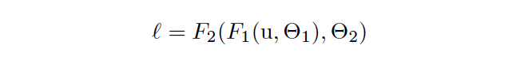

where F1 and F2 are arbitrary transformations, and the parameters  $\Theta_1, \Theta_2$ are to be learned so as to minimize the loss ℓ. 

> F1, F2는 임의의 변형값이며, 파라미터 $\Theta_1, \Theta_2$ 는 loss $\ell$ 을 최소화시키도록 학습한다.

Learning $\Theta_2$ can be viewed as if the inputs $x = F_1(u, \Theta_1)$ are fed into the sub-network
> $\Theta_2$를 학습시키는 것은 $x = F_1(u, \Theta_1)$를 input으로 하여, 하위 계층 네트워크에 입력되는것으로 볼 수 있다.

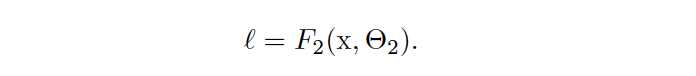

For example, a gradient descent step
> 경사 하강법 예시는 다음과 같다.

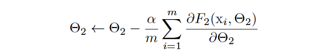

(for batch size $m$ and learning rate α) is exactly equivalent to that for a `stand-alone network` $F_2$ with input $x$. 

> 배치사이즈 $m$과 학습률 $\alpha$는 정확히 stand-alone 네트워크인 $x$를 input으로 하는 $F_2$와 정확히 동일하다.

Therefore, the input distribution properties that make training more efficient – such as having the same distribution between the training and test data – apply to training the sub-network as well. 

> 따라서 input 데이터의 분포 특성은 학습을 더 효율적으로 만든다. such as)학습데이터와 테스트데이터의 분포가 같을 경우 - 하위 네트워크에도 잘 적용된다.

As such it is advantageous for the distribution of $x$ to remain fixed over time. 

> 따라서, $x$의 분포는 시간이 지나더라도 유지되는것이 유리하다. 

Then, $\Theta_2$ does not have to readjust to compensate for the change in the distribution of x.
> 그렇게된다면, $\Theta_2$는 $x$의 분포 조정을 위해 재조정 할 필요가 없다.

Fixed distribution of inputs to a sub-network would have positive consequences for the layers outside the subnetwork, as well.

> 서브 네트워크에 대한 입력의 고정된 분포는 하위 네트워크 밖의 계층들에게도 긍정적인 결과를 가져올 것이다.

Consider a layer with a sigmoid activation function $z = g(Wu + b)$ where $u$ is the layer input, the weight matrix $W$ and bias vector $b$ are the layer parameters to be learned, and $g(x) = \frac{1}{1+exp(−x)}$. As $|x|$ increases, $g′(x)$ tends to zero.

> 위와 같은 시그모이드 활성화함수를 고려하여, $u$가 레이어의 input임을 고려하면 , $W$와 $b$는 레이어의 파라미터에의해 학습될것이며, $|x|$ 가 높을수록 경사는 0에 근사하게 될 것이다.

This means that for all dimensions of $x = Wu+b$ except those with small absolute values, the gradient flowing down to $u$ will vanish and the model will train slowly.

> 이것은 모든 차원이 $x$의 절대값을 사용하면, 절대값이 작은 경우를 제외하고는 $u$는 소멸될 것이다.

However, since $x$ is affected by $W, b$ and the parameters of all the layers below, changes to those parameters during training will likely move many dimensions of $x$ into the `saturated regime` of the nonlinearity and slow down the convergence

> 그러나 x는 W, b와 아래의 모든 층의 파라미터에 영향을 받기 때문에 훈련 중에 x의 많은 차원을 비선형성의 포화상태로 이동시키고 수렴을 늦출 것이다.

This effect is amplified as the network depth increases. 

> 이러한 효과는 네트워크 깊이가 증가함에 따라 증폭됩니다.

In practice, the `saturation problem` and the resulting vanishing gradients are usually addressed by using `Rectified Linear Units` (Nair & Hinton, 2010) ReLU(x) = max(x, 0), careful initialization (Bengio & Glorot, 2010; Saxe et al., 2013), and small learning rates. 

> 경사 소멸 및 급격하게 경사가 변화는 문제는 ReLU 활성화함수를 통해 어느정도 해결이 되었었다. 또한 초기값을 다루거나 learning rate를 바꾸는 방식으로도.

If, however, we could ensure that the distribution of nonlinearity inputs remains more stable as the network trains, then the optimizer would be less likely to get stuck in the saturated regime, and the training would accelerate.

> 그러나 비선형성인 Input 이 좀더 안정적으로 네트워크에 들어와서 학습이 된다면, 포화상태에 빠질 가능성이 낮아지고, 훈련속도 또한 가속화될 것이다.

We refer to the change in the distributions of internal nodes of a deep network, in the course of training, as `Internal Covariate Shift`. 

> 우리는 훈련 과정에서 심층 네트워크의 내부 노드 분포의 변화를 내부 공변량 이동이라고 한다.

Eliminating it offers a promise of faster training. 

> 이것을 제거함으로써 학습속도가 빨라진다.

We propose a new mechanism, which we call Batch Normalization, that takes a step towards reducing internal covariate shift, and in doing so dramatically accelerates the training of deep neural nets.  

> 우리는 내부 공변량 이동을 줄이고, 그렇게 함으로써 심층 신경망의 훈련을 획기적으로 가속화하는 배치 정규화라고 불리는 새로운 메커니즘을 제안한다.

It accomplishes this via a normalization step that fixes the means and variances of layer inputs. 

> 이것은 계층 입력의 평균과 분산을 수정하는 정규화 단계를 통해 달성된다.

Batch Normalization also has a beneficial effect on the gradient flow through the network, by reducing the dependence of gradients on the scale of the parameters or of their initial values.

> 배치 정규화는 또한 매개 변수의 척도 또는 초기 값에 대한 그레이디언트의 의존성을 줄임으로써 네트워크를 통한 그레이디언트 흐름에 유익한 영향을 미친다.

This allows us to use much higher learning rates without the risk of divergence. 

> 이것은 학습율을 높여도, 경사가 발산하는 문제가 없도록 한다.

Furthermore, batch normalization regularizes the model and reduces the need for Dropout (Srivastava et al., 2014).

> 게다가, 배치정규화는 모델에 규제를 해주며, DropOut의 필요성을 줄여준다.

Finally, Batch Normalization makes it possible to use saturating nonlinearities by preventing the network from getting stuck in the saturated modes.

> 마지막으로, 배치 정규화를 사용하면 비선형적인 활성화함수를 쓸 수 있다??

In Sec. 4.2, we apply Batch Normalization to the bestperforming ImageNet classification network, and show that we can match its performance using only 7% of the training steps, and can further exceed its accuracy by a `substantial margin`

> 4.2절에서는 Batch Normalization을 가장 성능이 좋은 ImageNet 분류 네트워크에 적용하고 학습 단계의 7%만 사용하여 동일한 성능을 낼 수 있으며 정확도도 훨씬 능가할 수 있음을 보여준다.

Using an ensemble of such networks trained with Batch Normalization, we achieve the top-5 error rate that improves upon the best known results on ImageNet classification.

> 배치정규화 앙상블을 적용하여, 우리는 ImageNet 분류기의 성능을 향상시켰다.
> : top-5 검증데이터셋의 error가 4.9%로 인간이 평가하는 것을 뛰어넘었다.

## 2. Towards Reducing Internal Covariate Shift

We define Internal Covariate Shift as the change in the distribution of network activations due to the change in network parameters during training. 

> 우리는 내부 공변량 이동을 훈련 중 네트워크 매개 변수의 변화로 인한 네트워크 활성화 분포의 변화로 정의한다.

To improve the training, we seek to reduce the internal covariate shift.

> 훈련을 개선하기 위하여,  우리는 내부 공변량 이동을 줄이는 방법을 탐색한다.

By fixing the distribution of the layer inputs x as the training progresses, we expect to improve the training speed.

> 학습이 진행됨에 따라 레이어 입력 x의 분포를 고정함으로써 학습 속도를 향상시킬 수 있을 것으로 기대하고 있습니다.

It has been long known (LeCun et al., 1998b; Wiesler & Ney, 2011) that the network training converges faster if its inputs are `whitened` – i.e., linearly transformed to have zero means and unit variances, and `decorrelated`. 

> 입력데이터가 whitend(? : 아마 표준화같은개념) 수렴속도가 더 빨라진다는 것은 이미 잘 알려져있다. - 평균 0을 갖으며, 단위 분산과 비상관성을 갖는다. 

As each layer observes the inputs produced by the layers below, it would be advantageous to achieve the same whitening of the inputs of each layer.

> 각 층이 아래 층에 의해 생성된 입력을 관찰하기 때문에 각 층의 입력에 대해 동일한 화이트닝을 달성하는 것이 유리할 것이다.

By whitening the inputs to each layer, we would take a step towards achieving the fixed distributions of inputs that would remove the ill effects of the internal covariate shift.

> 각 층에 대한 입력을 whitening 함으로써, 우리는 내부 공변량 이동의 부작용을 제거하기 위해,  입력의 고정된 분포를 위해 단계를 진행할것이다.

We could consider whitening activations at every training step or at some interval, either by __modifying the
network directly__ or by __changing the parameters of the optimization algorithm__ to depend on the `network activation values` (Wiesler et al., 2014; Raiko et al., 2012; Povey et al., 2014; Desjardins & Kavukcuoglu).

> 우리는 network를 직접 수정하거나, 파라미터 최적화 알고리즘을 변경함으로써 각 단계별 whitening 활성화를 진행할 수 있다. 
> 이는 network activation value에 의존적이다. (활성화함수 말하는건지?)

However, if these modifications are `interspersed` with the optimization steps, then the gradient descent step may attempt to update the parameters in a way that requires the normalization to be updated, which reduces the effect
of the gradient step

> 그러나 이 경우 드문드문 최적화 단계가 있다면, 경사 하강 단계는 정규화를 업데이트해야 하는 방식으로 매개변수를 업데이트하려고 시도할 수 있으며, 이는 경사 단계의 영향을 감소시킨다.

For example, consider a layer with the __input $u$__ that adds the learned bias $b$, and normalizes the result by subtracting the mean of the activation computed over the training data: $\hat{x} = x − E[x]$ where $x = u + b$, $X = \{x1...N\}$ is the set of values of $x$ over the training set, and $E[x] = \frac{1}{N}\sum_i^N xi$.

> 단계별로 input data에 대해서 정규화 과정을 진행하는것으로 해석됨.

If a gradient descent step ignores the dependence of $E[x]$ on $b$, then it will update $b \leftarrow b + \triangle b$, where  $\triangle b \propto −∂ℓ/∂ \hat{x}$
> 만약 경사하강법이 기대값$E[x]$ 와 $bias$를 무기한다면 위와 같이 업데이트 될 것이다.

Then $u+(b+\triangle b)-E[u+(b+\triangle b)]=u+b-E[u+b]$.
> 위와 같이 업데이트가 됐을 것이다?

Thus, the combination of the update to b and subsequent change in normalization led to no change in the output of the layer nor, consequently, the loss. 

> 그러므로, $b$에 대한 업데이트와 그에 따른 정규화 변경의 조합은 계층 출력의 변화도, 결과적으로 손실도 초래하지 않았다.

As the training continues, $b$ will grow indefinitely while the loss remains fixed.

> 훈련이 계속될수록 $b$는 손실이 고정된 상태에서 무한 성장한다.

This problemcan get worse if the normalization not only centers but also scales the activations.
> 이 문제는 정규화가 중심일 뿐만 아니라 활성화 함수로 스케일링 한다면, 더 악화될 수 있다.

We have observed this empirically in initial experiments, where the model blows up when the normalization parameters are computed outside the gradient descent step.

> 정규화 매개 변수가 경사 하강 단계 밖에서 계산될 때 모델이 폭파되는 초기 실험에서 이를 경험적으로 관찰했다.

The issue with the above approach is that the gradient descent optimization does not take into account the fact that the normalization takes place. 

> ㅋㅋ

To address this issue, we would like to ensure that, for any parameter values, the network always produces activations with the desired distribution.  

> 이 문제를 해결하기 위해, 우리는 모든 매개 변수 값에 대해 네트워크가 항상 원하는 분포로 활성화를 생성하도록 보장하고자 한다.

Doing so would allow the gradient of the loss with respect to the model parameters to account for the normalization, and for its dependence on the model parameters $\Theta$.

> 그렇게 하는 것은 정규화와 모델 매개변수 $\Theta$에 대한 의존성을 설명하기 위해 모델 매개변수에 대한 손실의 기울기를 허용할 것이다.

Let again x be a layer input, treated as a vector, and X be the set of these inputs over the training data set. 

> 다시 x를 벡터로 취급하는 레이어 입력으로 하고 X를 훈련 데이터 집합에 대한 이러한 입력들의 집합으로 하자.

The normalization can then be written as a transformation
> 그 정규화의 변환은 아래식처럼 쓸 수 있다.

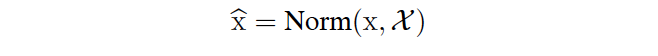

which depends not only on the given training example $x$ but on all examples $\chi$ – each of which depends on $\Theta$ if $x$ is generated by another layer. For backpropagation, we would need to compute the `Jacobians`

> 이는 주어진 학습 예제 𝑥 뿐만 아니라 모든 예제 𝜒에 따라 달라지는데, 각 예제 𝜒는 $x$가 다른 계층에 의해 생성될 경우 Θ에 따라 달라진다. 
> 역전파를 위해서는 자코비안들을 계산한다.

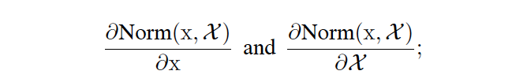

ignoring the latter term would lead to the explosion described above. 
> 후자의 용어를 무시하면, 위에서 설명한 기울기 폭발이 일어날 것이다.

Within this framework, whitening the layer inputs is expensive, as it requires computing the `covariance matrix` $Cov[x] = Ex_{∈\chi} [xxT ] − E[x]E[x]^T$ and its inverse square root, to produce the `whitened activations` $Cov[x]^{-1/2}(x − E[x])$, as well as the derivatives of these transforms for backpropagation. 

> 이 프레임워크에서는, layer input을 whkitening하는 연산은 비싸다. 우리는 연산을 위해 공분산행렬을 필요로 하며, 그것은 역수 및 루트를 씌워서 `whitend activations`를 만든다. 우리는 역전파를 위해 이것을 파생한다.

This motivates us to seek an alternative that performs input normalization in a way that is differentiable and does not require the analysis of the entire training set after every parameter update.

> 이것은 우리가 차별화 가능하고 모든 매개 변수 업데이트 후 전체 학습데이터의 분석을 요구하지 않는 방식으로 입력 정규화를 수행하는 대안을 찾도록 만든다.

Some of the previous approaches (e.g. (Lyu & Simoncelli, 2008)) use statistics computed over a single training example, or, in the case of image networks, over different feature maps at a given location.

> 이전 접근법 중 일부는 단일 훈련 예시에 대해, 또는 이미지 네트워크의 경우 주어진 위치의 다른 특징맵에 대해 계산된 통계값 사용한다.

However, this changes the representation ability of a network by discarding the absolute scale of activations.
> 그러나 이는 활성화의 절대적인 scale을 버림으로써 네트워크의 표현정보를 변화시킨다.

We want to a preserve the information in the network, by normalizing the activations in a training example relative to the statistics of the entire training data.
> 우리는 전체 훈련 데이터의 통계를 기준으로 훈련 예제의 활성화를 정규화하여 네트워크의 정보를 보존하고자 한다.

##  3. Normalization via Mini-Batch Statistics

Since the full whitening of each layer’s inputs is costly and not everywhere differentiable, we make two necessary simplifications. 

> 각 층의 입력에 대한 완전한 화이트닝은 비용이 많이 들고 어디에서나 구별할 수 있는 것은 아니기 때문에, 우리는 두 가지 필요한 단순화를 한다.

The first is that instead of whitening the features in layer inputs and outputs jointly, we will normalize each scalar feature independently, by making it have the mean of zero and the variance of 1. 

> 첫 번째는 레이어 입력과 출력의 특징을 공동으로 화이트닝하는 대신, 우리는 각 스칼라 특징을 0과 1의 분산으로 만들어 독립적으로 정규화할 것이다.

For a layer with $d$-dimensional input $x = (x^{(1)} . . . x^{(d)})$, we will normalize each dimension

> 위와같은 $d$ 차원의 input이 들어온다면, 우리는 아래와같이 각각의 차원은 정규화시킬것이다.

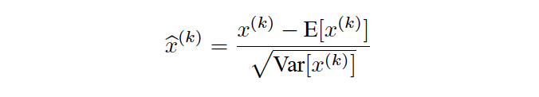

where the expectation and variance are computed over the training data set. 

> 여기서 학습 데이터 세트에 대한 기대값과 분산을 계산합니다.

As shown in (LeCun et al., 1998b), such normalization speeds up convergence, even when the features are not decorrelated.

> (LeCun et al., 1998b)에서 볼 수 있듯이, 이러한 정규화는 특징이 상관관계가 없는 경우에도 수렴 속도를 높인다.

Note that simply normalizing each input of a layer may change what the layer can represent. 

> 단순히 계층의 각 입력을 정규화하는 것은 계층이 나타낼 수 있는 것을 변화시킬 수 있다는 것을 주목하라.

For instance, normalizing the inputs of a sigmoid would constrain them to the linear regime of the nonlinearity. 

> 예를 들어, 시그모이드의 입력을 정규화하면 비선형성의 선형으로 제한된다.

To address this, we make sure that the transformation inserted in the network can represent the `identity transform`.
> 이를 해결하기 위해 네트워크에 삽입된 변환이 identity transform(? : 기본 정보로 추측) 을 나타낼 수 있는지 확인한다.

To accomplish this, we introduce, for each activation $x^{(k)}$, a pair of parameters $γ^{(k)}, β^{(k)}$, which scale and shift the normalized value:

> 각각의 모든 활성화함수 $x^{(k)}$에 대해, 각각의 쌍인 $γ^{(k)}, β^{(k)}$,는 스케일링 및 정규화값을 shift한다.

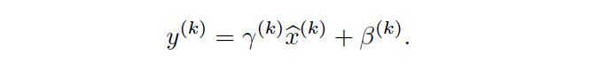

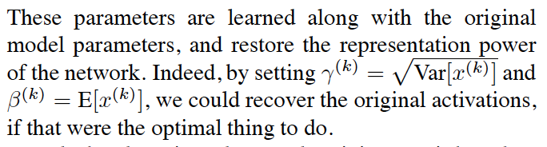

> 이러한 매개 변수는 원래 모델 매개 변수와 함께 학습되고 네트워크의 표현 능력을 복원한다.
> 위와 같이 설정한다면, 우리는 기본 활성화 를 복원할 수 있다.

In the batch setting where each training step is based on the entire training set, we would use the whole set to normalize activations.

> 각 훈련 단계가 전체 훈련 세트를 기반으로 하는 배치 설정에서 전체 세트를 사용하여 활성화를 정규화한다.

However, this is impractical when using stochastic optimization. 

> 그러나 이것은 확률적 최적화를 사용할 때 비현실적이다.

Therefore, we make the second simplification: since we use mini-batches in stochastic gradient training, each mini-batch produces estimates of the mean and variance of each activation.

> 따라서, 우리는 두 번째 단순화를 한다 : 확률적 경사 훈련에서 미니 배치를 사용하기 때문에, 각 미니 배치는 각 활성화의 평균과 분산에 대한 추정치를 생성한다.

This way, the statistics used for normalization can fully participate in the gradient backpropagation. 

> 이러한 방식으로 정규화에 사용되는 통계는 그레이디언트 역전파에 완전히 참여할 수 있다.

Note that the use of minibatches is enabled by __computation of per-dimension variances__ rather than joint covariances; 

> 미니배치의 사용은 전체 공분산보다는 차원당 분산 계산에 의해 가능하다.

in the joint case, regularization would be required since the mini-batch size is likely to be smaller than the number of activations being whitened, resulting in singular covariance matrices.

> 이 전체 경우, 미니 진동 크기가 흰색으로 변하는 활성의 수보다 작을 가능성이 높기 때문에 정규화가 요구되어 단수 공분산 행렬이 생성된다.

Consider a mini-batch B of size m.

> 크기가 m인 미니배치 B를 고려해보자. 

Since the normalization is applied to each activation independently, let us focus on a particular activation $x^{(k)}$ and omit $k$ for clarity. 

>정규화는 각 활성화에 독립적으로 적용되므로 특정 활성화 $x^{(k)}$에 초점을 맞추고 명확성을 위해 $k$를 생략합시다.

We have $m$ values of this activation in the mini-batch,

>우리는 미니배치안에서 $m$ 값의 활성화를 갖는다.

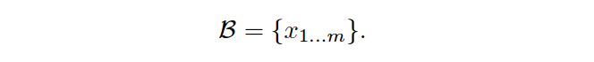

Let the normalized values be $\hat{x}_{1...m}$, and their linear transformations be $y_{1...m}$. 

> $\hat{x}_{1...m}$ 값을 정규화 하고, $y_{1...m}$ 로 선형변환 하자.

We refer to the transform as the Batch Normalizing Transform. 

> 아래와 같은 Batch Normalizing Transform 을 볼 수 있다.

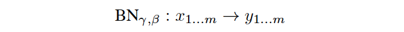

We present the BN Transform in Algorithm1. 

> 우리는 Algoritm1에 변환과정을 표현한다.

In the algorithm, $\epsilon$ is a constant added to the mini-batch variance for numerical stability.

> 해당 알고리즘에서 $\epsilon$는 수치의 안정성을 위해 미니 배치 분산에 추가되는 상수이다.

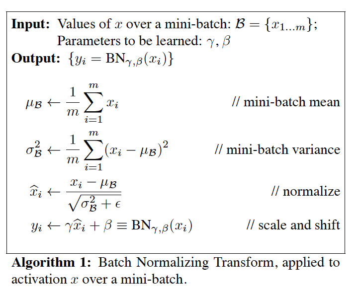

The BN transform can be added to a network to manipulate any activation.

> BN 변환은 활성화를 조작하기 위해 네트워크에 추가할 수 있다.

In the notation 𝑦=𝐵𝑁𝛾,𝛽(𝑥), we  indicate that the parameters γ and β are to be learned,
but it should be noted that the BN transform does not 
independently process the activation in each training example

> 위 식에서. 매개 변수 γ 와 β를 학습해야 한다는 것을 나타내지만, 
> BN 변환이 각 훈련 예제의 활성화를 독립적으로 처리하지 않는다는 점에 유의해야 한다.

Rather, BNγ,β(x) depends both on the training
example and the other examples in the mini-batch. 

> BNγ,β(x) 는 학습 예시와 다른 예시의 미니배치에 의존한다.

The  scaled and shifted values y are passed to other network layers.

> 축척 및 이동된 값 y는 다른 네트워크 도면층에 전달됩니다.

The normalized activations 𝑥̂ are internal to our
transformation, but their presence is crucial

> 정규화된 활성화 𝑥̂ 는 우리 변환 내부이지만, 그들의 존재는 중요하다.

The distributions  of values of any 𝑥̂  has the expected value of 0
and the variance of 1, as long as the elements of each
mini-batch are sampled from the same distribution, and
if we neglect 𝜖 .

> 각 미니 배치의 원소가 동일한 분포에서 추출되고, 우리가 𝜖 를 무시한다면,
> 임의의 𝑥̂ 값의 분포는 0의 기대값과 1의 분산을 갖는다.

> 전체 합은 0, 제곱의 평균은 1을 기대한다.
> 각각의 정규화 활성화 𝑥̂ (𝑘) 는 그 다음에 원래 네트워크에 의해 수행되는 다른 처리되는 
> 하위 네트워크의 선형변환 구성요소로 활용된다.

These sub-network  inputs all have fixed means and variances, and although
the joint distribution of these normalized 𝑥̂ (𝑘) can change
over the course of training, we expect that the introduction
of normalized inputs accelerates the training of the
sub-network and, consequently, the network as a whole.

> 이러한 서브 네트워크 입력은 모두 고정된 수단과 분산을 가지고 있으며, 
> 이러한 정규화된 𝑥̂ (𝑘) 의 공동 분포가 훈련 과정에 걸쳐 지속될 수 있지만, 
> 정규화된 입력의 도입은 서브 네트워크의 훈련을 가속화하고 결과적으로 
> 네트워크 전체의 훈련을 가속화할 것으로 기대한다.

During training we need to backpropagate the gradient
of loss ℓ through this transformation, as well as compute
the gradients with respect to the parameters of the
BN transform. We use chain rule, as follows (before simplification):

> 훈련 동안 우리는 이 변환을 통해 손실 θ의 기울기를 역전파하고 
> BN 변환의 매개 변수에 대한 기울기를 계산해야 한다.
> 다음과 같은 체인 규칙을 사용합니다(간단화 전).

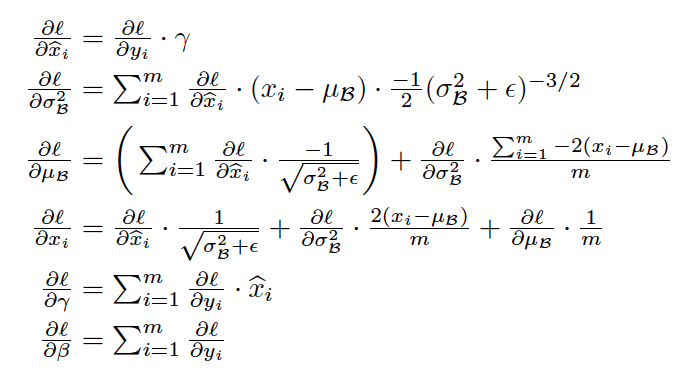

Thus, BN transform is a differentiable transformation that
introduces normalized activations into the network.

> 따라서 BN 변환은 네트워크에 정규화된 활성화를 도입하는 차별화 가능한 변환이다.

This  ensures that as the model is training, layers can continue  learning on input distributions that exhibit less internal covariate
shift, thus accelerating the training.

> 이를 통해 모델이 훈련 중인 동안 계층은 내부 공변량 이동을 나타내는 입력 분포를 계속 
> 학습할 수 있으므로 훈련을 가속화할 수 있다.

Furthermore,  the learned affine transform applied to these normalized
activations allows the BN transform to represent the identity
transformation and preserves the network capacity.

> 또한, 이러한 표준화된 활성화에 적용된 학습된 아핀 변환을 통해 BN 변환이 정체성 변환을 
> 나타내고 네트워크 용량을 보존할 수 있다.

### 3.1. Training and Inference with Batch-Normalized Networks
> BN 네트워크를 활용한 학습 및 추론

To Batch-Normalize a network, we specify a subset of activations 
and insert the BN transform for each of them, according to __Alg. 1__

> 네트워크를 일괄 정규화하기 위해 활성화의 하위 집합을 지정하고 
> 각 활성화에 대한 BN 변환을 삽입합니다.

Any layer that previously received
x as the input, now receives BN(x).

> 어떠한 레이어는 이전의 인풋x를 받고, 현재는 BN(x)를 받는다.

A model employing
Batch Normalization can be trained using batch gradient
descent, or Stochastic Gradient Descent with a mini-batch
size m > 1, or with any of its variants such as Adagrad

> 배치 정규화를 사용하는 모델은 경사적 배치 하강법 또는
> 최소 배치 크기 m > 1로 확률적 배치하강법을를 사용하여 훈련할 수 있다.

The normalization of activations that
depends on the mini-batch allows efficient training, but is
neither necessary nor desirable during inference;

> 미니 배치에 의존하는 활성화의 정규화는 효율적인 훈련을 가능케 하지만 
> 추론 중에는 불필요하거나 바람직하지 않다.

we want  the output to depend only on the input, deterministically.
For this, once the network has been trained, we use the  normalization
> 우리는 결정적으로 출력이 입력에만 의존하기를 원한다. 
> 이를 위해 네트워크가 훈련되면 정규화를 사용합니다.

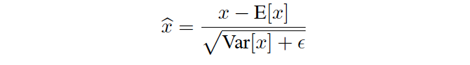
using the population, rather than mini-batch, statistics.
Neglecting 𝜖 , these normalized activations have the same
mean 0 and variance 1 as during training

> 최소 통계량 대신 모집단을 사용한다.
> 𝜖 를 무시하고, 이러한 정규화된 활성화는 훈련 중과 동일한 평균 0 과 분산 1을 가집니다.

We use the unbiased
variance estimate 𝑉𝑎𝑟[𝑥]=𝑚/(𝑚−1)⋅𝐸𝛽[𝜎2𝛽], where
the expectation is over trainingmini-batches of size m and 𝜎2𝛽 
are their sample variances

> 우리는 m 크기의 미니 배치를 훈련할 때 기대치가 초과되고 
> 𝜎2𝛽 가 표본 분산인 편향되지 않은 분산 추정치 Var[x]를 사용한다.

Using moving averages instead,
we can track the accuracy of a model as it trains.

> 대신 이동 평균을 사용하여 모델이 훈련되는 동안 정확성을 추적할 수 있습니다.

Since the means and variances are fixed during inference,
the normalization is simply a linear transform applied to each activation
> 추론하는 동안 평균과 분산이 고정되므로 정규화는 단순히 각 활성화에 적용되는 선형 변환입니다.

It may further be composed with the scaling by 𝛾 and shift by β, 
to yield a single linear transform that replaces BN(x).
> 이것은 BN(x)을 대체하는 단일 선형 변환을 생성하기 위해 
> 𝛾에 의한 스케일링과 β에 의한 시프트로 추가로 구성될 수 있다.

__Algorithm 2__ summarizes the procedure
for training batch-normalized networks.
> Algorithm 2 는 배치 정규화된 네트워크를 훈련시키는 절차를 요약한다.

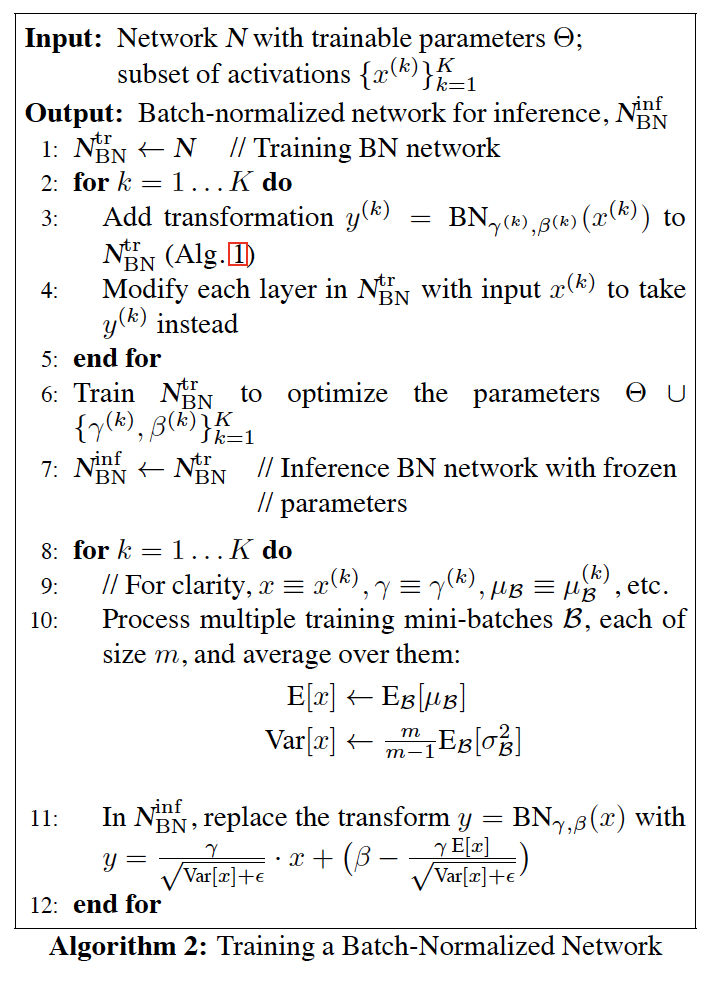

### 3.2 Batch-Normalized Convolutional Networks
> CNN에서의 배치 정규화

Batch Normalization can be applied to any set of activations
in the network.
> 배치 정규화는 네트워크의 모든 활성화 집합에 적용할 수 있습니다.

Here, we focus on transforms  that consist of an affine 
transformation followed by an element-wise nonlinearity:
> 여기서는 아핀 변환과 요소별 비선형성으로 구성된 변환에 초점을 맞춘다.

where W and b are learned parameters of the model, and
g(⋅) is the nonlinearity such as sigmoid or ReLU
> 여기서 W와 b는 모델의 학습된 매개변수이고,
> g(⋅)는 시그모이드 또는 ReLU와 같은 비선형성이다.

This formulation covers both fully-connected and convolutional layers.
> 이 공식은 완전히 연결된 레이어와 컨볼루션 레이어를 모두 포함한다.

We add the BN transform immediately before the
nonlinearity, by normalizing x = Wu+b.
> 우리는 비선형성 바로 앞에 x = Wu+b를 정규화하여 BN 변환을 추가합니다.

We could have  also normalized the layer inputs u, 
but since u is likely  the output of another nonlinearity,
the shape of its distribution is likely to change during training, 
and constraining  its first and second moments would not eliminate
the covariate  shift.

> 레이어 입력 u도 정규화할 수 있지만,
> u는 다른 비선형성의 출력일 가능성이 높기 때문에,
> 훈련 중에 분포의 모양이 변경될 가능성이 높으며, 
> 첫 번째와 두 번째 모멘트를 제한해도 공변량 이동이 제거되지 않는다.

In contrast, Wu + b is more likely to have a symmetric, 
non-sparse distribution, that is “more Gaussian” (Hyvarinen & Oja, 2000);
> 반대로, Wu + b는 대칭의 non-sparse 분포를 가질 가능성이 더 높다. : 

normalizing it is likely to
produce activations with a stable distribution.
> 정규화하면 안정적인 분포로 활성화될 가능성이 높다.

Note that, since we normalize Wu+b, the bias b can be
ignored since its effect will be canceled by the subsequent
mean subtraction (the role of the bias is subsumed by β in
__Alg. 1__). 

> 알아둬요, 우리가 정규화 하면Wu+b, 바이어스 b는 그 효과가 
> 후속적인 평균 차감 에 의해 취소되기 때문에 무시될 수 있다.
> (편향의 역할은 β에 포함된다.)

Thus, z = g(Wu + b) is replaced with

where the BN transform is applied independently to each
dimension of x = Wu, with a separate pair of learned
parameters γ(k), β(k) per dimension.

> 여기서 BN 변환은 x = Wu의 각 치수에 독립적으로 적용되며, 
> 학습된 매개변수 쌍은 차원 당 γ(k), β(k)이다.

For convolutional layers, we additionally want the normalization
to obey the convolutional property – so that
different elements of the same feature map, at different
locations, are normalized in the same way.

> 컨볼루션 레이어의 경우 정규화가 컨볼루션 속성을 따르기를 추가로 원하므로 
> 다른 위치에서 동일한 피쳐 맵의 다른 요소가 동일한 방식으로 정규화된다.

To achieve  this, we jointly normalize all the activations
in a minibatch, over all locations

> 이를 달성하기 위해, 우리는 모든 위치에 걸쳐 미니배치의 모든 활성화를 공동으로 정규화한다.
 
In __Alg. 1__, we let B be the set of
all values in a feature map across both the elements of a
mini-batch and spatial locations – so for a mini-batch of
size m and feature maps of size p x q, we use the effective
mini-batch of size m′ = |B| = m ⋅ p q.

> 우리는 B를 미니 배치와 공간 위치 모두에 걸친 형상 맵의 모든 값 집합이 되도록 한다.
> 따라서 크기 m의 미니 배치와 크기 p x q의 형상 맵의 경우,
> 우리는 미니배치 사이즈  m′ = |B| = m ⋅ p q 를 사용한다.

We learn a
pair of parameters γ(k) and β(k) per feature map, rather
than per activation.
> 활성화 당이 아니라 특징 맵당 매개 변수 θ(k)와 β(k) 쌍을 학습한다.

__Alg. 2__ is modified similarly, so that
during inference the BN transform applies the same linear
transformation to each activation in a given feature map.

> Alg. 2는 유사하게 수정되어 추론 중에 BN 변환은 주어진 형상 맵의 각 
> 활성화에 동일한 선형 변환을 적용한다.

### 3.3 Batch Normalization enables higher learning rates
> 배치정규화는 높은 학습율을 가능하게 한다.

In traditional deep networks, too-high learning rate may
result in the gradients that explode or vanish, as well as
getting stuck in poor local minima. 
> 전통적인 딥 네트워크에서는 학습 속도가 너무 높으면 지역 최소화가 잘못되어
> 폭발하거나 사라지는 그레이디언트가 발생할 수 있다.

Batch Normalization helps address these issues.
> 배치정규화는 이러한 문제를 해결할 수 있다.

By normalizing activations
throughout the network, it prevents small changes
to the parameters from amplifying into larger and suboptimal
changes in activations in gradients;

> 네트워크 전체의 활성화를 정규화함으로써 매개변수에 대한 작은 변화가 
> 그레이디언트의 활성화의 더 크고 차선의 변화로 증폭되는 것을 방지한다.

for instance, it prevents the training 
from getting stuck in the saturated regimes of nonlinearities.
> 예를 들어, 이것은 훈련이 포화 상태의 비선형성에 갇히는 것을 방지한다.

Batch Normalization also makes training 
more resilient to the parameter scale.
> 배치 정규화를 통해 교육을 매개 변수 척도에 보다 탄력적으로 수행할 수 있습니다.

Normally, large learning rates may
increase the scale of layer parameters, which then amplify
the gradient during backpropagation and lead to the model
explosion.
> 일반적으로, 큰 학습 속도는 계층 매개 변수의 크기를 증가시킬 수 있으며, 
> 이는 역전파 중 기울기를 증폭시키고 모델 폭발로 이어진다.

However, with Batch Normalization, backpropagation
through a layer is unaffected by the scale of
its parameters. 
> 그러나 배치 정규화를 사용하면 도면층을 통한 역전달은 매개변수의 규모에 영향을 받지 않습니다

Indeed, for a scalar a,
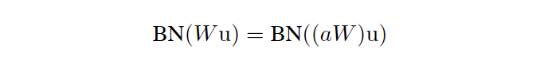

and we can show that

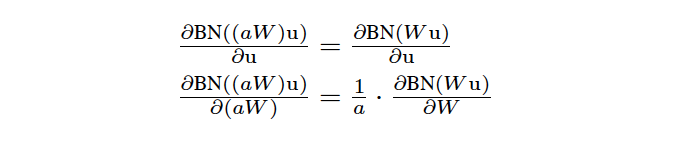

The scale does not affect the layer Jacobian nor, consequently,
the gradient propagation.

> 이 척도는 레이어 야코비안에도 영향을 미치지 않으며 
> 결과적으로 경사 전파에도 영향을 미치지 않는다.

Moreover, larger  weights lead to smaller gradients, 
and Batch Normalization  will stabilize the parameter growth.
> 또한 가중치가 클수록 그레이디언트가 작아지고 배치 정규화가 파라미터 증가를 안정화시킨다.

---
We further conjecture that Batch Normalization may
lead the layer Jacobians to have singular values close to 1,
which is known to be beneficial for training (Saxe et al.,
2013).

> 우리는 배치 정규화가 레이어 야코비안들로 하여금 훈련에 유익한 1에 가까운 
> singular values 을 갖도록 할 수 있다고 더 추측한다.

Consider two consecutive layers with normalized inputs, 
and the transformation between these normalized vectors:  𝑧̂ =𝐹(𝑥̂ ) .

> 정규화된 입력을 가진 두 개의 연속 레이어와 정규화된 벡터 사이의 변환을 고려하자.

If we assume that 𝑥̂  and 𝑧̂ are Gaussian
and uncorrelated, and that 𝐹(𝑥̂ ) ≈ J𝑥̂ is a linear transformation
for the given model parameters, then both 𝑥̂ and 𝑧̂ 
have unit covariances

> 만약 𝑥̂ 와 𝑧̂ 가 가우스이고 상관관계가 없으며, 
> 𝐹(𝑥̂)가 주어진 모델 파라미터에 대한 선형 변환이라고 가정한다면,
> 𝑥̂ 와 𝑧̂ 는 모두 단위 공분산을 갖는다.

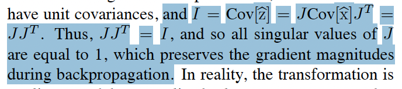
> 증명과정이며, 단일값 J가 1이다(?)
> 이는 역전파 중에 기울기 크기를 유지합니다.

In reality, the transformation is
not linear, and the normalized values are not guaranteed to
be Gaussian nor independent, but we nevertheless expect
Batch Normalization to help make gradient propagation
better behaved.

> 실제로는 변환이 선형적이지 않고 
> 정규화된 값이 가우스이거나 독립적이라고 보장되지 않지만,
> 그럼에도 불구하고 배치 정규화가 그레이디언트 전파를 
> 더 잘 작동시키는 데 도움이 될 것으로 기대한다.

The precise effect of Batch Normalization on 
gradient propagation remains an area of further study.
> 배치 정규화가 기울기 전파에 미치는 정확한 영향은 추가 연구 영역으로 남아 있다.

### 3.4. Batch Normalization regularizes the model
> 배치정규화는 모델을 규제한다.

When training with Batch Normalization, a training example
is seen in conjunction with other examples in the
mini-batch, and the training network no longer producing
deterministic values for a given training example.

> 배치 정규화를 사용하여 훈련할 때, 
> 훈련 예제는 미니 배치의 다른 예와 함께 보여지며,
> 훈련 네트워크는 주어진 훈련 예에 대한 결정론적 값을 더 이상 생성하지 않는다.

In  our experiments, we found this effect to be advantageous
to the generalization of the network.
> 우리의 실험에서, 우리는 이 효과가 네트워크의 일반화에 유리하다는 것을 발견했다.

Whereas Dropout (Srivastava et al., 2014) is typically used to 
reduce overfitting,  in a batch-normalized network we found 
that it can be either removed or reduced in strength.
> 드롭아웃은 일반적으로 과적합을 줄이는 데 사용되는 반면, 
> 배치 정규화된 네트워크에서 제거하거나 강도를 줄일 수 있다.
