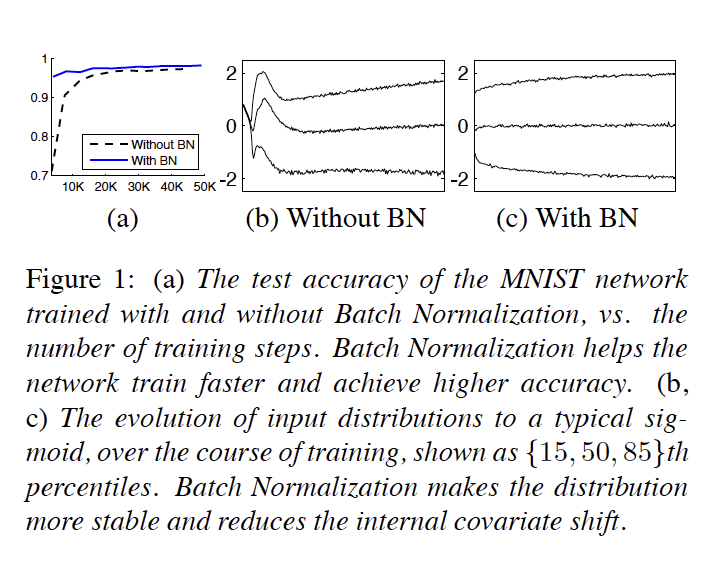
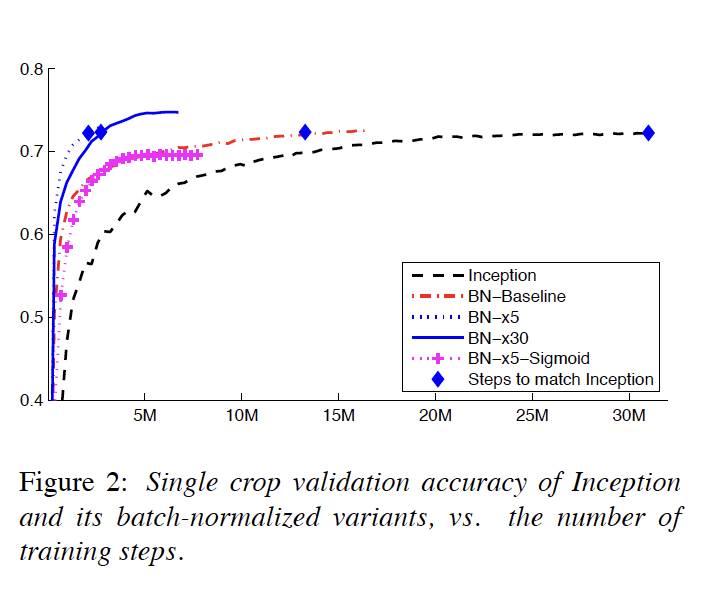
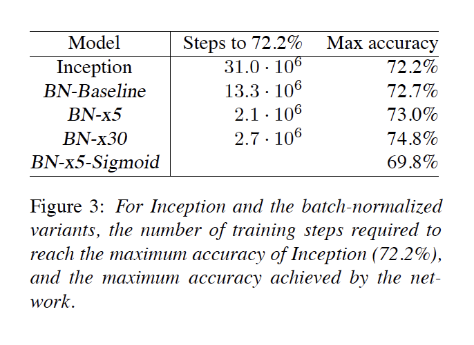

# Batch Normalization: Accelerating Deep Network Training by Reducing Internal Covariate Shift : 2015

## 0. Abstract
Training Deep Neural Networks is complicated by the fact
that the distribution of each layer’s inputs changes during
training, as the parameters of the previous layers change.

> 심층 신경망의 훈련은 이전 layer의 매개 변수가 변경됨에 따라, 훈련 중에 각 layer의 입력 분포가 변경된다는 사실 때문에 복잡하다.

This slows down the training by requiring lower learning
rates and careful parameter initialization, and makes it `notoriously`
hard to train models with `saturating nonlinearities`.

> learning rate를 낮추거나 초기 파라미터를 설정을 조심스럽게 하면, 학습속도가 늦으지머,
> 이 경우는 포화 비선형성을 가진 모델을 학습시키는 것을 어렵게 만든다.

We refer to this phenomenon as `internal covariate
shift`, and address the problem by normalizing layer inputs.

> 우리는 이 상황을 `internal covariate shift` 라고 부르며, 레이어의 입력값을 정규화
> 함으로써 우리는 이 문제를 해결한다.

Our method draws its strength from making normalization
a part of the model architecture and performing the
normalization for each training mini-batch.

> 우리의 방식은 모델의 각 파트와, 각각의 미니배치단위들을 정규화를 진행한다.

Batch Normalization allows us to use much higher learning rates and
be less careful about initialization.

> 배치정규화를 사용하면 매우 높은 learning rate를 사용할 수 있게 해주며, 
> 초기값 생성에 덜 신경을 쓰게 해주는 역할을 한다.
 
It also acts as a regularizer, in some cases eliminating the need for Dropout.

> 이것은 또한 정규화의 기능을 수행함으로써, DropuOut의 필요성을 줄여준다.

Applied to a state-of-the-art image classification model,
Batch Normalization achieves the same accuracy with 14
times fewer training steps, and `beats the original model`
by a `significant margin`. 

> SOTA를 달성한 이미지 분류모델에 적용함으로써, 같은 정확도지만 14번의 학습 step을 줄였으며,
> 그리고 기존 모델의 성능을 크게 앞질렀습니다.

Using an ensemble of batch normalized networks, we improve upon the best published
result on ImageNet classification: reaching 4.9% top-5 validation error (and 4.8% test error), exceeding the accuracy of human raters.

> 배치정규화 앙상블을 적용하여, 우리는 ImageNet 분류기의 성능을 향상시켰다.
> : top-5 검증데이터셋의 error가 4.9%로 인간이 평가하는 것을 뛰어넘었다.

---
## 1. Introduction

Deep learning has dramatically advanced the state of the art in vision, speech, and many other areas.

> 딥러닝은 드라마틱하게 비젼, 음성 등 다양한 분야에서 발전중이다.

Stochastic gradient descent (SGD) has proved to be an effective way of training deep networks, and SGD variants such as momentum (Sutskever et al., 2013) and Adagrad (Duchi et al., 2011) have been used to achieve state of the
art performance. 

> 확률적 경사하강법은 깊은 신경망을 효율적으로 학습하는데에 증명되었으며
> 그리고 모멘텀, AdaGrad 등과 같은 SGD의 변형이 SOTA를 달성하였다.

SGD optimizes the parameters $\Theta$ of the network, so as to minimize the loss
> SGD 네트워크의 경사($\Theta$)를 최적화하며 loss 값을 줄인다.

where x1...N is the training data set. 

> x1, ... N은 학습 데이터셋이다.

With SGD, the training proceeds in steps, and at each step we consider a minibatch x1...m of size m. 

> SGD를 사용함으로써, 학습은 순차적으로 진행되며 우리는 미니배치 x1 부터 m까지의 단계를 고려하낟.

The mini-batch is used to approximate the gradient of the loss function with respect to the parameters, by computing

> 미니배치는 손실함수를 최적의 경사에 근접하게 하기 위해 사용된다. 아래와 같은 연산을 통해서..

Using mini-batches of examples, as `opposed` to one example
at a time, is helpful in several ways.

> 미니배치를 사용하는 것은 다양한 방면에 도움을 준다.

First, the gradient of the loss over a mini-batch is an estimate of the gradient over the training set, whose quality improves as the batch size increases. 

> 첫째, 미니 배치에 대한 손실의 기울기는 배치 크기가 증가함에 따라 품질이 향상되는 훈련 세트에 대한 기울기의 추정치이다.

Second, computation over a batch can be much more efficient than m computations for individual examples, due to the parallelism afforded by the modern computing platforms.

> 둘째, 미니배치를 사용하는 것은 최근 계산 플랫폼들이 병렬처리를 허용하기 때문에, 각각을 m번 계산하는것보다 더 효율적이다.
---

While stochastic gradient is simple and effective, it requires careful tuning of the model hyper-parameters, specifically the learning rate used in optimization, as well as the initial values for the model parameters. 

> 반면, SGD는 단순하고 효율적이지만, 그것은 hyper parameter 튜닝을 정교하게 해야하며, 학습율또한 정규하게 작업해야한다. 또한 초기가중치도 그렇다.

The training is complicated by the fact that the inputs to each layer are affected by the parameters of all preceding layers – so that small changes to the network parameters amplify as the network becomes deeper.

> 그 학습은 모든 input이 각각의 layer가 진행될대마다 영향을 끼치기 때문에, 깊어질수록 영향이 크다.

The change in the distributions of layers’ inputs presents a problem because the layers need to continuously adapt to the new distribution. 

> 각 층의 레이어들은 새로운 분포에 대한 변화를 필요로 한다.

When the input distribution to a learning system changes, it is said to experience `covariate shift` (Shimodaira, 2000). 

> 학습 때, 입력값의 분포가 변한다면 covariate shift(공변량 이동)를 겪는다.

This is typically handled via `domain adaptation`(Jiang, 2008). 

> 이것은 도메인 적응(?)을 통해 해결된다.

However, the notion of covariate shift can be extended beyond the learning system as a whole, to apply to its parts, such as a sub-network or a layer. 

> 그러나 공변량 이동의 개념은 학습 시스템 전체 뿐 아니라, 하위 네트워크 및 레이어에도 영향을 끼친다.

Consider a network computing
> 아래와 같은 network 연산을 고려한다.

where F1 and F2 are arbitrary transformations, and the parameters  $\Theta_1, \Theta_2$ are to be learned so as to minimize the loss ℓ. 

> F1, F2는 임의의 변형값이며, 파라미터 $\Theta_1, \Theta_2$ 는 loss $\ell$ 을 최소화시키도록 학습한다.

Learning $\Theta_2$ can be viewed as if the inputs $x = F_1(u, \Theta_1)$ are fed into the sub-network
> $\Theta_2$를 학습시키는 것은 $x = F_1(u, \Theta_1)$를 input으로 하여, 하위 계층 네트워크에 입력되는것으로 볼 수 있다.

For example, a gradient descent step
> 경사 하강법 예시는 다음과 같다.

(for batch size $m$ and learning rate α) is exactly equivalent to that for a `stand-alone network` $F_2$ with input $x$. 

> 배치사이즈 $m$과 학습률 $\alpha$는 정확히 stand-alone 네트워크인 $x$를 input으로 하는 $F_2$와 정확히 동일하다.

Therefore, the input distribution properties that make training more efficient – such as having the same distribution between the training and test data – apply to training the sub-network as well. 

> 따라서 input 데이터의 분포 특성은 학습을 더 효율적으로 만든다. such as)학습데이터와 테스트데이터의 분포가 같을 경우 - 하위 네트워크에도 잘 적용된다.

As such it is advantageous for the distribution of $x$ to remain fixed over time. 

> 따라서, $x$의 분포는 시간이 지나더라도 유지되는것이 유리하다. 

Then, $\Theta_2$ does not have to readjust to compensate for the change in the distribution of x.
> 그렇게된다면, $\Theta_2$는 $x$의 분포 조정을 위해 재조정 할 필요가 없다.

Fixed distribution of inputs to a sub-network would have positive consequences for the layers outside the subnetwork, as well.

> 서브 네트워크에 대한 입력의 고정된 분포는 하위 네트워크 밖의 계층들에게도 긍정적인 결과를 가져올 것이다.

Consider a layer with a sigmoid activation function $z = g(Wu + b)$ where $u$ is the layer input, the weight matrix $W$ and bias vector $b$ are the layer parameters to be learned, and $g(x) = \frac{1}{1+exp(−x)}$. As $|x|$ increases, $g′(x)$ tends to zero.

> 위와 같은 시그모이드 활성화함수를 고려하여, $u$가 레이어의 input임을 고려하면 , $W$와 $b$는 레이어의 파라미터에의해 학습될것이며, $|x|$ 가 높을수록 경사는 0에 근사하게 될 것이다.

This means that for all dimensions of $x = Wu+b$ except those with small absolute values, the gradient flowing down to $u$ will vanish and the model will train slowly.

> 이것은 모든 차원이 $x$의 절대값을 사용하면, 절대값이 작은 경우를 제외하고는 $u$는 소멸될 것이다.

However, since $x$ is affected by $W, b$ and the parameters of all the layers below, changes to those parameters during training will likely move many dimensions of $x$ into the `saturated regime` of the nonlinearity and slow down the convergence

> 그러나 x는 W, b와 아래의 모든 층의 파라미터에 영향을 받기 때문에 훈련 중에 x의 많은 차원을 비선형성의 포화상태로 이동시키고 수렴을 늦출 것이다.

This effect is amplified as the network depth increases. 

> 이러한 효과는 네트워크 깊이가 증가함에 따라 증폭됩니다.

In practice, the `saturation problem` and the resulting vanishing gradients are usually addressed by using `Rectified Linear Units` (Nair & Hinton, 2010) ReLU(x) = max(x, 0), careful initialization (Bengio & Glorot, 2010; Saxe et al., 2013), and small learning rates. 

> 경사 소멸 및 급격하게 경사가 변화는 문제는 ReLU 활성화함수를 통해 어느정도 해결이 되었었다. 또한 초기값을 다루거나 learning rate를 바꾸는 방식으로도.

If, however, we could ensure that the distribution of nonlinearity inputs remains more stable as the network trains, then the optimizer would be less likely to get stuck in the saturated regime, and the training would accelerate.

> 그러나 비선형성인 Input 이 좀더 안정적으로 네트워크에 들어와서 학습이 된다면, 포화상태에 빠질 가능성이 낮아지고, 훈련속도 또한 가속화될 것이다.

We refer to the change in the distributions of internal nodes of a deep network, in the course of training, as `Internal Covariate Shift`. 

> 우리는 훈련 과정에서 심층 네트워크의 내부 노드 분포의 변화를 내부 공변량 이동이라고 한다.

Eliminating it offers a promise of faster training. 

> 이것을 제거함으로써 학습속도가 빨라진다.

We propose a new mechanism, which we call Batch Normalization, that takes a step towards reducing internal covariate shift, and in doing so dramatically accelerates the training of deep neural nets.  

> 우리는 내부 공변량 이동을 줄이고, 그렇게 함으로써 심층 신경망의 훈련을 획기적으로 가속화하는 배치 정규화라고 불리는 새로운 메커니즘을 제안한다.

It accomplishes this via a normalization step that fixes the means and variances of layer inputs. 

> 이것은 계층 입력의 평균과 분산을 수정하는 정규화 단계를 통해 달성된다.

Batch Normalization also has a beneficial effect on the gradient flow through the network, by reducing the dependence of gradients on the scale of the parameters or of their initial values.

> 배치 정규화는 또한 매개 변수의 척도 또는 초기 값에 대한 그레이디언트의 의존성을 줄임으로써 네트워크를 통한 그레이디언트 흐름에 유익한 영향을 미친다.

This allows us to use much higher learning rates without the risk of divergence. 

> 이것은 학습율을 높여도, 경사가 발산하는 문제가 없도록 한다.

Furthermore, batch normalization regularizes the model and reduces the need for Dropout (Srivastava et al., 2014).

> 게다가, 배치정규화는 모델에 규제를 해주며, DropOut의 필요성을 줄여준다.

Finally, Batch Normalization makes it possible to use saturating nonlinearities by preventing the network from getting stuck in the saturated modes.

> 마지막으로, 배치 정규화를 사용하면 비선형적인 활성화함수를 쓸 수 있다??

In Sec. 4.2, we apply Batch Normalization to the bestperforming ImageNet classification network, and show that we can match its performance using only 7% of the training steps, and can further exceed its accuracy by a `substantial margin`

> 4.2절에서는 Batch Normalization을 가장 성능이 좋은 ImageNet 분류 네트워크에 적용하고 학습 단계의 7%만 사용하여 동일한 성능을 낼 수 있으며 정확도도 훨씬 능가할 수 있음을 보여준다.

Using an ensemble of such networks trained with Batch Normalization, we achieve the top-5 error rate that improves upon the best known results on ImageNet classification.

> 배치정규화 앙상블을 적용하여, 우리는 ImageNet 분류기의 성능을 향상시켰다.
> : top-5 검증데이터셋의 error가 4.9%로 인간이 평가하는 것을 뛰어넘었다.

## 2. Towards Reducing Internal Covariate Shift

We define Internal Covariate Shift as the change in the distribution of network activations due to the change in network parameters during training. 

> 우리는 내부 공변량 이동을 훈련 중 네트워크 매개 변수의 변화로 인한 네트워크 활성화 분포의 변화로 정의한다.

To improve the training, we seek to reduce the internal covariate shift.

> 훈련을 개선하기 위하여,  우리는 내부 공변량 이동을 줄이는 방법을 탐색한다.

By fixing the distribution of the layer inputs x as the training progresses, we expect to improve the training speed.

> 학습이 진행됨에 따라 레이어 입력 x의 분포를 고정함으로써 학습 속도를 향상시킬 수 있을 것으로 기대하고 있습니다.

It has been long known (LeCun et al., 1998b; Wiesler & Ney, 2011) that the network training converges faster if its inputs are `whitened` – i.e., linearly transformed to have zero means and unit variances, and `decorrelated`. 

> 입력데이터가 whitend(? : 아마 표준화같은개념) 수렴속도가 더 빨라진다는 것은 이미 잘 알려져있다. - 평균 0을 갖으며, 단위 분산과 비상관성을 갖는다. 

As each layer observes the inputs produced by the layers below, it would be advantageous to achieve the same whitening of the inputs of each layer.

> 각 층이 아래 층에 의해 생성된 입력을 관찰하기 때문에 각 층의 입력에 대해 동일한 화이트닝을 달성하는 것이 유리할 것이다.

By whitening the inputs to each layer, we would take a step towards achieving the fixed distributions of inputs that would remove the ill effects of the internal covariate shift.

> 각 층에 대한 입력을 whitening 함으로써, 우리는 내부 공변량 이동의 부작용을 제거하기 위해,  입력의 고정된 분포를 위해 단계를 진행할것이다.

We could consider whitening activations at every training step or at some interval, either by __modifying the
network directly__ or by __changing the parameters of the optimization algorithm__ to depend on the `network activation values` (Wiesler et al., 2014; Raiko et al., 2012; Povey et al., 2014; Desjardins & Kavukcuoglu).

> 우리는 network를 직접 수정하거나, 파라미터 최적화 알고리즘을 변경함으로써 각 단계별 whitening 활성화를 진행할 수 있다. 
> 이는 network activation value에 의존적이다. (활성화함수 말하는건지?)

However, if these modifications are `interspersed` with the optimization steps, then the gradient descent step may attempt to update the parameters in a way that requires the normalization to be updated, which reduces the effect
of the gradient step

> 그러나 이 경우 드문드문 최적화 단계가 있다면, 경사 하강 단계는 정규화를 업데이트해야 하는 방식으로 매개변수를 업데이트하려고 시도할 수 있으며, 이는 경사 단계의 영향을 감소시킨다.

For example, consider a layer with the __input $u$__ that adds the learned bias $b$, and normalizes the result by subtracting the mean of the activation computed over the training data: $\hat{x} = x − E[x]$ where $x = u + b$, $X = \{x1...N\}$ is the set of values of $x$ over the training set, and $E[x] = \frac{1}{N}\sum_i^N xi$.

> 단계별로 input data에 대해서 정규화 과정을 진행하는것으로 해석됨.

If a gradient descent step ignores the dependence of $E[x]$ on $b$, then it will update $b \leftarrow b + \triangle b$, where  $\triangle b \propto −∂ℓ/∂ \hat{x}$
> 만약 경사하강법이 기대값$E[x]$ 와 $bias$를 무기한다면 위와 같이 업데이트 될 것이다.

Then $u+(b+\triangle b)-E[u+(b+\triangle b)]=u+b-E[u+b]$.
> 위와 같이 업데이트가 됐을 것이다?

Thus, the combination of the update to b and subsequent change in normalization led to no change in the output of the layer nor, consequently, the loss. 

> 그러므로, $b$에 대한 업데이트와 그에 따른 정규화 변경의 조합은 계층 출력의 변화도, 결과적으로 손실도 초래하지 않았다.

As the training continues, $b$ will grow indefinitely while the loss remains fixed.

> 훈련이 계속될수록 $b$는 손실이 고정된 상태에서 무한 성장한다.

This problemcan get worse if the normalization not only centers but also scales the activations.
> 이 문제는 정규화가 중심일 뿐만 아니라 활성화 함수로 스케일링 한다면, 더 악화될 수 있다.

We have observed this empirically in initial experiments, where the model blows up when the normalization parameters are computed outside the gradient descent step.

> 정규화 매개 변수가 경사 하강 단계 밖에서 계산될 때 모델이 폭파되는 초기 실험에서 이를 경험적으로 관찰했다.

The issue with the above approach is that the gradient descent optimization does not take into account the fact that the normalization takes place. 

> 위의 접근법의 문제는 경사 하강 최적화는 정규화가 일어난다는 사실을 고려하지 않는다는 것이다.

To address this issue, we would like to ensure that, for any parameter values, the network always produces activations with the desired distribution.  

> 이 문제를 해결하기 위해, 우리는 모든 매개 변수 값에 대해 네트워크가 항상 원하는 분포로 활성화를 생성하도록 보장하고자 한다.

Doing so would allow the gradient of the loss with respect to the model parameters to account for the normalization, and for its dependence on the model parameters $\Theta$.

> 그렇게 하는 것은 정규화와 모델 매개변수 $\Theta$에 대한 의존성을 설명하기 위해 모델 매개변수에 대한 손실의 기울기를 허용할 것이다.

Let again x be a layer input, treated as a vector, and X be the set of these inputs over the training data set. 

> 다시 x를 벡터로 취급하는 레이어 입력으로 하고 X를 훈련 데이터 집합에 대한 이러한 입력들의 집합으로 하자.

The normalization can then be written as a transformation
> 그 정규화의 변환은 아래식처럼 쓸 수 있다.

which depends not only on the given training example $x$ but on all examples $\chi$ – each of which depends on $\Theta$ if $x$ is generated by another layer. For backpropagation, we would need to compute the `Jacobians`

> 이는 주어진 학습 예제 𝑥 뿐만 아니라 모든 예제 𝜒에 따라 달라지는데, 각 예제 𝜒는 $x$가 다른 계층에 의해 생성될 경우 Θ에 따라 달라진다. 
> 역전파를 위해서는 자코비안들을 계산한다.

ignoring the latter term would lead to the explosion described above. 
> 후자의 용어를 무시하면, 위에서 설명한 기울기 폭발이 일어날 것이다.

Within this framework, whitening the layer inputs is expensive, as it requires computing the `covariance matrix` $Cov[x] = Ex_{∈\chi} [xxT ] − E[x]E[x]^T$ and its inverse square root, to produce the `whitened activations` $Cov[x]^{-1/2}(x − E[x])$, as well as the derivatives of these transforms for backpropagation. 

> 이 프레임워크에서는, layer input을 whkitening하는 연산은 비싸다. 우리는 연산을 위해 공분산행렬을 필요로 하며, 그것은 역수 및 루트를 씌워서 `whitend activations`를 만든다. 우리는 역전파를 위해 이것을 파생한다.

This motivates us to seek an alternative that performs input normalization in a way that is differentiable and does not require the analysis of the entire training set after every parameter update.

> 이것은 우리가 차별화 가능하고 모든 매개 변수 업데이트 후 전체 학습데이터의 분석을 요구하지 않는 방식으로 입력 정규화를 수행하는 대안을 찾도록 만든다.

Some of the previous approaches (e.g. (Lyu & Simoncelli, 2008)) use statistics computed over a single training example, or, in the case of image networks, over different feature maps at a given location.

> 이전 접근법 중 일부는 단일 훈련 예시에 대해, 또는 이미지 네트워크의 경우 주어진 위치의 다른 특징맵에 대해 계산된 통계값 사용한다.

However, this changes the representation ability of a network by discarding the absolute scale of activations.
> 그러나 이는 활성화의 절대적인 scale을 버림으로써 네트워크의 표현정보를 변화시킨다.

We want to a preserve the information in the network, by normalizing the activations in a training example relative to the statistics of the entire training data.
> 우리는 전체 훈련 데이터의 통계를 기준으로 훈련 예제의 활성화를 정규화하여 네트워크의 정보를 보존하고자 한다.

##  3. Normalization via Mini-Batch Statistics

Since the full whitening of each layer’s inputs is costly and not everywhere differentiable, we make two necessary simplifications. 

> 각 층의 입력에 대한 완전한 화이트닝은 비용이 많이 들고 어디에서나 구별할 수 있는 것은 아니기 때문에, 우리는 두 가지 필요한 단순화를 한다.

The first is that instead of whitening the features in layer inputs and outputs jointly, we will normalize each scalar feature independently, by making it have the mean of zero and the variance of 1. 

> 첫 번째는 레이어 입력과 출력의 특징을 공동으로 화이트닝하는 대신, 우리는 각 스칼라 특징을 0과 1의 분산으로 만들어 독립적으로 정규화할 것이다.

For a layer with $d$-dimensional input $x = (x^{(1)} . . . x^{(d)})$, we will normalize each dimension

> 위와같은 $d$ 차원의 input이 들어온다면, 우리는 아래와같이 각각의 차원은 정규화시킬것이다.

where the expectation and variance are computed over the training data set. 

> 여기서 학습 데이터 세트에 대한 기대값과 분산을 계산합니다.

As shown in (LeCun et al., 1998b), such normalization speeds up convergence, even when the features are not decorrelated.

> (LeCun et al., 1998b)에서 볼 수 있듯이, 이러한 정규화는 특징이 상관관계가 없는 경우에도 수렴 속도를 높인다.

Note that simply normalizing each input of a layer may change what the layer can represent. 

> 단순히 계층의 각 입력을 정규화하는 것은 계층이 나타낼 수 있는 것을 변화시킬 수 있다는 것을 주목하라.

For instance, normalizing the inputs of a sigmoid would constrain them to the linear regime of the nonlinearity. 

> 예를 들어, 시그모이드의 입력을 정규화하면 비선형성의 선형으로 제한된다.

To address this, we make sure that the transformation inserted in the network can represent the `identity transform`.
> 이를 해결하기 위해 네트워크에 삽입된 변환이 identity transform(? : 기본 정보로 추측) 을 나타낼 수 있는지 확인한다.

To accomplish this, we introduce, for each activation $x^{(k)}$, a pair of parameters $γ^{(k)}, β^{(k)}$, which scale and shift the normalized value:

> 각각의 모든 활성화함수 $x^{(k)}$에 대해, 각각의 쌍인 $γ^{(k)}, β^{(k)}$,는 스케일링 및 정규화값을 shift한다.

> 이러한 매개 변수는 원래 모델 매개 변수와 함께 학습되고 네트워크의 표현 능력을 복원한다.
> 위와 같이 설정한다면, 우리는 기본 활성화 를 복원할 수 있다.

In the batch setting where each training step is based on the entire training set, we would use the whole set to normalize activations.

> 각 훈련 단계가 전체 훈련 세트를 기반으로 하는 배치 설정에서 전체 세트를 사용하여 활성화를 정규화한다.

However, this is impractical when using stochastic optimization. 

> 그러나 이것은 확률적 최적화를 사용할 때 비현실적이다.

Therefore, we make the second simplification: since we use mini-batches in stochastic gradient training, each mini-batch produces estimates of the mean and variance of each activation.

> 따라서, 우리는 두 번째 단순화를 한다 : 확률적 경사 훈련에서 미니 배치를 사용하기 때문에, 각 미니 배치는 각 활성화의 평균과 분산에 대한 추정치를 생성한다.

This way, the statistics used for normalization can fully participate in the gradient backpropagation. 

> 이러한 방식으로 정규화에 사용되는 통계는 그레이디언트 역전파에 완전히 참여할 수 있다.

Note that the use of minibatches is enabled by __computation of per-dimension variances__ rather than joint covariances; 

> 미니배치의 사용은 전체 공분산보다는 차원당 분산 계산에 의해 가능하다.

in the joint case, regularization would be required since the mini-batch size is likely to be smaller than the number of activations being whitened, resulting in singular covariance matrices.

> 이 전체 경우, 미니 진동 크기가 흰색으로 변하는 활성의 수보다 작을 가능성이 높기 때문에 정규화가 요구되어 단수 공분산 행렬이 생성된다.

Consider a mini-batch B of size m.

> 크기가 m인 미니배치 B를 고려해보자. 

Since the normalization is applied to each activation independently, let us focus on a particular activation $x^{(k)}$ and omit $k$ for clarity. 

>정규화는 각 활성화에 독립적으로 적용되므로 특정 활성화 $x^{(k)}$에 초점을 맞추고 명확성을 위해 $k$를 생략합시다.

We have $m$ values of this activation in the mini-batch,

>우리는 미니배치안에서 $m$ 값의 활성화를 갖는다.

Let the normalized values be $\hat{x}_{1...m}$, and their linear transformations be $y_{1...m}$. 

> $\hat{x}_{1...m}$ 값을 정규화 하고, $y_{1...m}$ 로 선형변환 하자.

We refer to the transform as the Batch Normalizing Transform. 

> 아래와 같은 Batch Normalizing Transform 을 볼 수 있다.

We present the BN Transform in Algorithm1. 

> 우리는 Algoritm1에 변환과정을 표현한다.

In the algorithm, $\epsilon$ is a constant added to the mini-batch variance for numerical stability.

> 해당 알고리즘에서 $\epsilon$는 수치의 안정성을 위해 미니 배치 분산에 추가되는 상수이다.

The BN transform can be added to a network to manipulate any activation.

> BN 변환은 활성화를 조작하기 위해 네트워크에 추가할 수 있다.

In the notation 𝑦=𝐵𝑁𝛾,𝛽(𝑥), we  indicate that the parameters γ and β are to be learned,
but it should be noted that the BN transform does not 
independently process the activation in each training example

> 위 식에서. 매개 변수 γ 와 β를 학습해야 한다는 것을 나타내지만, 
> BN 변환이 각 훈련 예제의 활성화를 독립적으로 처리하지 않는다는 점에 유의해야 한다.

Rather, BNγ,β(x) depends both on the training
example and the other examples in the mini-batch. 

> BNγ,β(x) 는 학습 예시와 다른 예시의 미니배치에 의존한다.

The  scaled and shifted values y are passed to other network layers.

> 축척 및 이동된 값 y는 다른 네트워크 도면층에 전달됩니다.

The normalized activations 𝑥̂ are internal to our
transformation, but their presence is crucial

> 정규화된 활성화 𝑥̂ 는 우리 변환 내부이지만, 그들의 존재는 중요하다.

The distributions  of values of any 𝑥̂  has the expected value of 0
and the variance of 1, as long as the elements of each
mini-batch are sampled from the same distribution, and
if we neglect 𝜖 .

> 각 미니 배치의 원소가 동일한 분포에서 추출되고, 우리가 𝜖 를 무시한다면,
> 임의의 𝑥̂ 값의 분포는 0의 기대값과 1의 분산을 갖는다.

> 전체 합은 0, 제곱의 평균은 1을 기대한다.
> 각각의 정규화 활성화 𝑥̂ (𝑘) 는 그 다음에 원래 네트워크에 의해 수행되는 다른 처리되는 
> 하위 네트워크의 선형변환 구성요소로 활용된다.

These sub-network  inputs all have fixed means and variances, and although
the joint distribution of these normalized 𝑥̂ (𝑘) can change
over the course of training, we expect that the introduction
of normalized inputs accelerates the training of the
sub-network and, consequently, the network as a whole.

> 이러한 서브 네트워크 입력은 모두 고정된 수단과 분산을 가지고 있으며, 
> 이러한 정규화된 𝑥̂ (𝑘) 의 공동 분포가 훈련 과정에 걸쳐 지속될 수 있지만, 
> 정규화된 입력의 도입은 서브 네트워크의 훈련을 가속화하고 결과적으로 
> 네트워크 전체의 훈련을 가속화할 것으로 기대한다.

During training we need to backpropagate the gradient
of loss ℓ through this transformation, as well as compute
the gradients with respect to the parameters of the
BN transform. We use chain rule, as follows (before simplification):

> 훈련 동안 우리는 이 변환을 통해 손실 θ의 기울기를 역전파하고 
> BN 변환의 매개 변수에 대한 기울기를 계산해야 한다.
> 다음과 같은 체인 규칙을 사용합니다(간단화 전).

Thus, BN transform is a differentiable transformation that
introduces normalized activations into the network.

> 따라서 BN 변환은 네트워크에 정규화된 활성화를 도입하는 차별화 가능한 변환이다.

This  ensures that as the model is training, layers can continue  learning on input distributions that exhibit less internal covariate
shift, thus accelerating the training.

> 이를 통해 모델이 훈련 중인 동안 계층은 내부 공변량 이동을 나타내는 입력 분포를 계속 
> 학습할 수 있으므로 훈련을 가속화할 수 있다.

Furthermore,  the learned affine transform applied to these normalized
activations allows the BN transform to represent the identity
transformation and preserves the network capacity.

> 또한, 이러한 표준화된 활성화에 적용된 학습된 아핀 변환을 통해 BN 변환이 정체성 변환을 
> 나타내고 네트워크 용량을 보존할 수 있다.

### 3.1. Training and Inference with Batch-Normalized Networks
> BN 네트워크를 활용한 학습 및 추론

To Batch-Normalize a network, we specify a subset of activations 
and insert the BN transform for each of them, according to __Alg. 1__

> 네트워크를 일괄 정규화하기 위해 활성화의 하위 집합을 지정하고 
> 각 활성화에 대한 BN 변환을 삽입합니다.

Any layer that previously received
x as the input, now receives BN(x).

> 어떠한 레이어는 이전의 인풋x를 받고, 현재는 BN(x)를 받는다.

A model employing
Batch Normalization can be trained using batch gradient
descent, or Stochastic Gradient Descent with a mini-batch
size m > 1, or with any of its variants such as Adagrad

> 배치 정규화를 사용하는 모델은 경사적 배치 하강법 또는
> 최소 배치 크기 m > 1로 확률적 배치하강법을를 사용하여 훈련할 수 있다.

The normalization of activations that
depends on the mini-batch allows efficient training, but is
neither necessary nor desirable during inference;

> 미니 배치에 의존하는 활성화의 정규화는 효율적인 훈련을 가능케 하지만 
> 추론 중에는 불필요하거나 바람직하지 않다.

we want  the output to depend only on the input, deterministically.
For this, once the network has been trained, we use the  normalization
> 우리는 결정적으로 출력이 입력에만 의존하기를 원한다. 
> 이를 위해 네트워크가 훈련되면 정규화를 사용합니다.

using the population, rather than mini-batch, statistics.
Neglecting 𝜖 , these normalized activations have the same
mean 0 and variance 1 as during training

> 최소 통계량 대신 모집단을 사용한다.
> 𝜖 를 무시하고, 이러한 정규화된 활성화는 훈련 중과 동일한 평균 0 과 분산 1을 가집니다.

We use the unbiased
variance estimate 𝑉𝑎𝑟[𝑥]=𝑚/(𝑚−1)⋅𝐸𝛽[𝜎2𝛽], where
the expectation is over trainingmini-batches of size m and 𝜎2𝛽
are their sample variances

> 우리는 m 크기의 미니 배치를 훈련할 때 기대치가 초과되고 
> 𝜎2𝛽 가 표본 분산인 편향되지 않은 분산 추정치 Var[x]를 사용한다.

Using moving averages instead,
we can track the accuracy of a model as it trains.

> 대신 이동 평균을 사용하여 모델이 훈련되는 동안 정확성을 추적할 수 있습니다.

Since the means and variances are fixed during inference,
the normalization is simply a linear transform applied to each activation
> 추론하는 동안 평균과 분산이 고정되므로 정규화는 단순히 각 활성화에 적용되는 선형 변환입니다.

It may further be composed with the scaling by 𝛾 and shift by β, 
to yield a single linear transform that replaces BN(x).
> 이것은 BN(x)을 대체하는 단일 선형 변환을 생성하기 위해 
> 𝛾에 의한 스케일링과 β에 의한 시프트로 추가로 구성될 수 있다.

__Algorithm 2__ summarizes the procedure
for training batch-normalized networks.
> Algorithm 2 는 배치 정규화된 네트워크를 훈련시키는 절차를 요약한다.

### 3.2 Batch-Normalized Convolutional Networks
> CNN에서의 배치 정규화

Batch Normalization can be applied to any set of activations
in the network.
> 배치 정규화는 네트워크의 모든 활성화 집합에 적용할 수 있습니다.

Here, we focus on transforms  that consist of an affine 
transformation followed by an element-wise nonlinearity:
> 여기서는 아핀 변환과 요소별 비선형성으로 구성된 변환에 초점을 맞춘다.

where W and b are learned parameters of the model, and
g(⋅) is the nonlinearity such as sigmoid or ReLU
> 여기서 W와 b는 모델의 학습된 매개변수이고,
> g(⋅)는 시그모이드 또는 ReLU와 같은 비선형성이다.

This formulation covers both fully-connected and convolutional layers.
> 이 공식은 완전히 연결된 레이어와 컨볼루션 레이어를 모두 포함한다.

We add the BN transform immediately before the
nonlinearity, by normalizing x = Wu+b.
> 우리는 비선형성 바로 앞에 x = Wu+b를 정규화하여 BN 변환을 추가합니다.

We could have  also normalized the layer inputs u, 
but since u is likely  the output of another nonlinearity,
the shape of its distribution is likely to change during training, 
and constraining  its first and second moments would not eliminate
the covariate  shift.

> 레이어 입력 u도 정규화할 수 있지만,
> u는 다른 비선형성의 출력일 가능성이 높기 때문에,
> 훈련 중에 분포의 모양이 변경될 가능성이 높으며, 
> 첫 번째와 두 번째 모멘트를 제한해도 공변량 이동이 제거되지 않는다.

In contrast, Wu + b is more likely to have a symmetric, 
non-sparse distribution, that is “more Gaussian” (Hyvarinen & Oja, 2000);
> 반대로, Wu + b는 대칭의 non-sparse 분포를 가질 가능성이 더 높다. : 

normalizing it is likely to
produce activations with a stable distribution.
> 정규화하면 안정적인 분포로 활성화될 가능성이 높다.

Note that, since we normalize Wu+b, the bias b can be
ignored since its effect will be canceled by the subsequent
mean subtraction (the role of the bias is subsumed by β in
__Alg. 1__). 

> 알아둬요, 우리가 정규화 하면Wu+b, 바이어스 b는 그 효과가 
> 후속적인 평균 차감 에 의해 취소되기 때문에 무시될 수 있다.
> (편향의 역할은 β에 포함된다.)

Thus, z = g(Wu + b) is replaced with

where the BN transform is applied independently to each
dimension of x = Wu, with a separate pair of learned
parameters γ(k), β(k) per dimension.

> 여기서 BN 변환은 x = Wu의 각 치수에 독립적으로 적용되며, 
> 학습된 매개변수 쌍은 차원 당 γ(k), β(k)이다.

For convolutional layers, we additionally want the normalization
to obey the convolutional property – so that
different elements of the same feature map, at different
locations, are normalized in the same way.

> 컨볼루션 레이어의 경우 정규화가 컨볼루션 속성을 따르기를 추가로 원하므로 
> 다른 위치에서 동일한 피쳐 맵의 다른 요소가 동일한 방식으로 정규화된다.

To achieve  this, we jointly normalize all the activations
in a minibatch, over all locations

> 이를 달성하기 위해, 우리는 모든 위치에 걸쳐 미니배치의 모든 활성화를 공동으로 정규화한다.
 
In __Alg. 1__, we let B be the set of
all values in a feature map across both the elements of a
mini-batch and spatial locations – so for a mini-batch of
size m and feature maps of size p x q, we use the effective
mini-batch of size m′ = |B| = m ⋅ p q.

> 우리는 B를 미니 배치와 공간 위치 모두에 걸친 형상 맵의 모든 값 집합이 되도록 한다.
> 따라서 크기 m의 미니 배치와 크기 p x q의 형상 맵의 경우,
> 우리는 미니배치 사이즈  m′ = |B| = m ⋅ p q 를 사용한다.

We learn a
pair of parameters γ(k) and β(k) per feature map, rather
than per activation.
> 활성화 당이 아니라 특징 맵당 매개 변수 θ(k)와 β(k) 쌍을 학습한다.

__Alg. 2__ is modified similarly, so that
during inference the BN transform applies the same linear
transformation to each activation in a given feature map.

> Alg. 2는 유사하게 수정되어 추론 중에 BN 변환은 주어진 형상 맵의 각 
> 활성화에 동일한 선형 변환을 적용한다.

### 3.3 Batch Normalization enables higher learning rates
> 배치정규화는 높은 학습율을 가능하게 한다.

In traditional deep networks, too-high learning rate may
result in the gradients that explode or vanish, as well as
getting stuck in poor local minima. 
> 전통적인 딥 네트워크에서는 학습 속도가 너무 높으면 지역 최소화가 잘못되어
> 폭발하거나 사라지는 그레이디언트가 발생할 수 있다.

Batch Normalization helps address these issues.
> 배치정규화는 이러한 문제를 해결할 수 있다.

By normalizing activations
throughout the network, it prevents small changes
to the parameters from amplifying into larger and suboptimal
changes in activations in gradients;

> 네트워크 전체의 활성화를 정규화함으로써 매개변수에 대한 작은 변화가 
> 그레이디언트의 활성화의 더 크고 차선의 변화로 증폭되는 것을 방지한다.

for instance, it prevents the training 
from getting stuck in the saturated regimes of nonlinearities.
> 예를 들어, 이것은 훈련이 포화 상태의 비선형성에 갇히는 것을 방지한다.

Batch Normalization also makes training 
more resilient to the parameter scale.
> 배치 정규화를 통해 교육을 매개 변수 척도에 보다 탄력적으로 수행할 수 있습니다.

Normally, large learning rates may
increase the scale of layer parameters, which then amplify
the gradient during backpropagation and lead to the model
explosion.
> 일반적으로, 큰 학습 속도는 계층 매개 변수의 크기를 증가시킬 수 있으며, 
> 이는 역전파 중 기울기를 증폭시키고 모델 폭발로 이어진다.

However, with Batch Normalization, backpropagation
through a layer is unaffected by the scale of
its parameters. 
> 그러나 배치 정규화를 사용하면 도면층을 통한 역전달은 매개변수의 규모에 영향을 받지 않습니다

Indeed, for a scalar a,

and we can show that

The scale does not affect the layer Jacobian nor, consequently,
the gradient propagation.

> 이 척도는 레이어 야코비안에도 영향을 미치지 않으며 
> 결과적으로 경사 전파에도 영향을 미치지 않는다.

Moreover, larger  weights lead to smaller gradients, 
and Batch Normalization  will stabilize the parameter growth.
> 또한 가중치가 클수록 그레이디언트가 작아지고 배치 정규화가 파라미터 증가를 안정화시킨다.

---
We further conjecture that Batch Normalization may
lead the layer Jacobians to have singular values close to 1,
which is known to be beneficial for training (Saxe et al.,
2013).

> 우리는 배치 정규화가 레이어 야코비안들로 하여금 훈련에 유익한 1에 가까운 
> singular values 을 갖도록 할 수 있다고 더 추측한다.

Consider two consecutive layers with normalized inputs, 
and the transformation between these normalized vectors:  𝑧̂ =𝐹(𝑥̂ ) .

> 정규화된 입력을 가진 두 개의 연속 레이어와 정규화된 벡터 사이의 변환을 고려하자.

If we assume that 𝑥̂  and 𝑧̂ are Gaussian
and uncorrelated, and that 𝐹(𝑥̂ ) ≈ J𝑥̂ is a linear transformation
for the given model parameters, then both 𝑥̂ and 𝑧̂ 
have unit covariances

> 만약 𝑥̂ 와 𝑧̂ 가 가우스이고 상관관계가 없으며, 
> 𝐹(𝑥̂)가 주어진 모델 파라미터에 대한 선형 변환이라고 가정한다면,
> 𝑥̂ 와 𝑧̂ 는 모두 단위 공분산을 갖는다.

> 증명과정이며, 단일값 J가 1이다(?)
> 이는 역전파 중에 기울기 크기를 유지합니다.

In reality, the transformation is
not linear, and the normalized values are not guaranteed to
be Gaussian nor independent, but we nevertheless expect
Batch Normalization to help make gradient propagation
better behaved.

> 실제로는 변환이 선형적이지 않고 
> 정규화된 값이 가우스이거나 독립적이라고 보장되지 않지만,
> 그럼에도 불구하고 배치 정규화가 그레이디언트 전파를 
> 더 잘 작동시키는 데 도움이 될 것으로 기대한다.

The precise effect of Batch Normalization on 
gradient propagation remains an area of further study.
> 배치 정규화가 기울기 전파에 미치는 정확한 영향은 추가 연구 영역으로 남아 있다.

### 3.4. Batch Normalization regularizes the model
> 배치정규화는 모델을 규제한다.

When training with Batch Normalization, a training example
is seen in conjunction with other examples in the
mini-batch, and the training network no longer producing
deterministic values for a given training example.

> 배치 정규화를 사용하여 훈련할 때, 
> 훈련 예제는 미니 배치의 다른 예와 함께 보여지며,
> 훈련 네트워크는 주어진 훈련 예에 대한 결정론적 값을 더 이상 생성하지 않는다.

In  our experiments, we found this effect to be advantageous
to the generalization of the network.
> 우리의 실험에서, 우리는 이 효과가 네트워크의 일반화에 유리하다는 것을 발견했다.

Whereas Dropout (Srivastava et al., 2014) is typically used to 
reduce overfitting,  in a batch-normalized network we found 
that it can be either removed or reduced in strength.
> 드롭아웃은 일반적으로 과적합을 줄이는 데 사용되는 반면, 
> 배치 정규화된 네트워크에서 제거하거나 강도를 줄일 수 있다.

## 4. Experiments
### 4.1 Activations over time
To verify the effects of internal covariate shift on training,
and the ability of Batch Normalization to combat it,
we considered the problem of predicting the digit class on
the MNIST dataset
> 내부 공변량 이동이 헉숩에 미치는 영향과 이를 해결하는 배치 정규화의 
> 능력을 검증하기 위해 MNIST 데이터 세트의 숫자 클래스를 예측하는 문제를 고려했다.

We used a very simple network, with a 28x28 binary image as input,
and fully-connected hidden layers with 100 activations each.
> 28x28 이진 이미지를 입력으로 하는 매우 간단한 네트워크와 
> 각각 100개의 활성화로 완전히 연결된 은닉층을 사용했습니다.

Each hidden layer computes y = g(Wu+b) with sigmoid  
nonlinearity, and the weights W initialized to small random
Gaussian values. 
> 각 은닉 계층은 시그모이드 비선형성을 갖는 y = g(Wu+b)와 
> 작은 무작위 가우스 값으로 초기화된 가중치 W를 계산한다.

The last hidden layer is followed
by a fully-connected layer with 10 activations (one per
class) and cross-entropy loss
> 마지막 은닉 레이어는 10개의 활성화(클래스당 1개)와 
> 교차 엔트로피 손실로 완전히 연결된 레이어가 뒤따른다.

We trained the network for
50000 steps, with 60 examples per mini-batch. 
We added Batch Normalization to each hidden layer 
of the network, as in Sec. 3.1
> 미니 배치당 60개의 예제를 사용하여 50000단계에 대해 네트워크를 훈련했다.
> 3.1절과 같이 네트워크의 숨겨진 각 계층에 배치 정규화를 추가하였다.

We were interested in the comparison between
the baseline and batch-normalized networks, rather
than achieving the state of the art performance on MNIST
(which the described architecture does not).
> 우리는 MNIST에서 최첨단 성능(설명된 아키텍처가 달성하지 못하는)을 달성하기보다는
> 기준 네트워크와 배치 정규화된 네트워크 간의 비교에 관심이 있었다.

Figure 1(a) shows the fraction of correct predictions
by the two networks on held-out test data, as training
progresses
> 그림 1(a)는 홀드-아웃 테스트에서 두 네트워크에 의한 정확한 
> 예측 비율을 보여줍니다. 교육이 진행됨에 따라 데이터

The batch-normalized network enjoys the
higher test accuracy. To investigate why, we studied inputs
to the sigmoid, in the original network N and batch-normalized
network  BN (Alg. 2) over the course of training.

> 배치 정규화된 네트워크는 테스트 정확도가 높습니다. 
> 이유를 조사하기 위해 훈련 과정에 걸쳐 원래 네트워크 N과
> 배치 정규화된 네트워크 BN(Alg. 2)에서 시그모이드에 대한 입력을 연구했다.

 
In Fig. 1(b,c) we show, for one typical activation from  the 
last hidden layer of each network, how its distribution evolves
> 그림 1(b,c)에서는 각 네트워크의 마지막 은닉 계층에서 하나의
> 일반적인 활성화에 대해 분포가 어떻게 진화하는지 보여준다.

The distributions in the original network
change significantly over time, both in their mean and
the variance, which complicates the training of the subsequent
layers
> 원래 네트워크의 분포는 평균과 분산 모두에서 시간이 지남에 따라 크게 변화하며,
> 이는 후속 계층의 훈련을 복잡하게 한다.

In contrast, the distributions in the batchnormalized
network are much more stable as training progresses,
which aids the training.
> 대조적으로, 배치 정규화된 네트워크의 분포는 다음과 같이 훨씬 더 안정적이다.
> 훈련의 진행, 훈련에 도움이 된다.

### 4.2. ImageNet classification
We applied Batch Normalization to a new variant of the
Inception network  trained on the ImageNet classification task.
> 우리는 ImageNet 분류 작업에 대해 훈련된 새로운 변형
> 인셉션 네트워크에 배치 정규화를 적용했다.

The network has a large number of convolutional and
pooling layers, with a softmax layer to predict the image
class, out of 1000 possibilities.
> 네트워크에는 이미지 클래스를 예측하는 소프트맥스 레이어와 함께
> 1000개의 가능성 중 많은 수의 컨볼루션 및 풀링 레이어가 있다.

Convolutional layers use ReLU as the nonlinearity
> 컨볼루션 레이어는 비선형성으로 ReLU를 사용합니다.

The main difference to the network
described in is that the 5 * 5
convolutional layers are replaced by two consecutive layers
of 3 * 3 convolutions with up to 128 filters
> 앞에서 설명한 네트워크와의 주요 차이점은 5 * 5 컨볼루션 레이어가 최대 
> 128개의 필터가 있는 3 * 3 컨볼루션 레이어의 두 개의 연속
> 레이어로 대체된다는 것입니다.

The network contains 13.6 *10^6 parameters, and, other than 
the top softmax layer, has no fully-connected layers.
More details are given the Appendix.
> 네트워크에는 13.6 *10^6 파라미터가 포함되며, 상단 소프트맥스
> 레이어 외에 완전히 연결된 레이어가 없습니다.
> 자세한 내용은 부록을 참조하세요.

We refer to this model
as Inception in the rest of the text. The model was trained
using a version of Stochastic Gradient Descent with momentum(
Sutskever et al., 2013), using themini-batch size
of 32.

> 우리는 이 모델을 본문의 나머지 부분에서 인셉션이라고 부릅니다.
> 모델은 32의 미니 배치 크기를 사용하여 모멘텀이 있는 확률적
> 경사 강하 버전을 사용하여 훈련되었다.

The trainingwas performed using a large-scale, distributed
architecture (similar to (Dean et al., 2012)). All
networks are evaluated as training progresses by computing
the validation accuracy @1, i.e. the probability of
predicting the correct label out of 1000 possibilities, on
a held-out set, using a single crop per image.
> 훈련은 대규모 분산 아키텍처를 사용하여 수행되었다(Dean et al., 2012). 
> 모든 네트워크는 검증 정확도 @1, 즉 이미지당 단일 크롭을 사용하여 홀드아웃 
> 세트에서 1000개의 가능성 중 올바른 레이블을 
> 예측할 확률을 계산함으로써 교육 진행률로 평가된다.

In our experiments, we evaluated several modifications
of Inception with Batch Normalization. In all cases, Batch
Normalization was applied to the input of each nonlinearity,
in a convolutional way, as described in section 3.2,
while keeping the rest of the architecture constant.
> 실험에서 배치 정규화를 사용한 인셉션의 몇 가지 수정 사항을 평가했다.
> 모든 경우에, 배치 정규화는 아키텍처의 나머지를 일정하게 유지하면서, 
> 섹션 3.2에서 설명된 대로, 컨볼루션 방식으로, 각 비선형성의 입력에 적용되었습니다.

#### 4.2.1 Accelerating BN Networks
Simply adding Batch Normalization to a network does not
take full advantage of our method. To do so, we further
changed the network and its training parameters, as follows:
> 단순히 배치 정규화를 네트워크에 추가하는 것은 우리의 방법을 최대한 활용하지 않는다.
> 이를 위해 다음과 같이 네트워크와 교육 매개 변수를 추가로 변경했다.

Increase learning rate. In a batch-normalized model,
we have been able to achieve a training speedup from
higher learning rates, with no ill side effects (Sec. 3.3).
> 학습률을 높입니다. 배치 정규화 모델에서, 우리는 부작용 
> 없이 더 높은 학습 속도에서 훈련 속도를 높일 수 있었다(3.3항).

Remove Dropout. As described in Sec. 3.4, Batch Normalization
fulfills some of the same goals as Dropout. Removing
Dropout from Modified BN-Inception speeds up
training, without increasing overfitting.
> 드롭아웃을 제거합니다. 3.4항에서 설명한 바와 같이 배치 정규화는 드롭아웃과 
> 동일한 목표를 달성합니다. 수정된 BN-인셉션에서 드롭아웃을 제거하면 
> 과적합이 증가하지 않고 교육 속도가 빨라집니다.

Reduce the L2 weight regularization. While in Inception
an L2 loss on the model parameters controls overfitting,
in Modified BN-Inception the weight of this loss is
reduced by a factor of 5. We find that this improves the
accuracy on the held-out validation data.
> L2 가중치 규제를 줄입니다. Inception에서 모델 매개변수의 L2 손실이
> 과적합을 제어하는 반면, Modified BN-Inception에서는 
> 이 손실의 무게가 5배만큼 감소한다. 우리는 이것이 보류된 검증 데이터의 
> 정확도를 향상시킨다는 것을 발견했다.

Accelerate the learning rate decay. In training Inception,
learning rate was decayed exponentially. Because
our network trains faster than Inception, we lower the
learning rate 6 times faster.
> 학습 속도 저하를 가속화합니다. 인셉션 훈련에서 학습 속도는 기하급수적으로 
> 감소했습니다. 우리 네트워크는 인셉션보다 더 빨리 훈련하기 때문에, 
> 우리는 학습 속도를 6배 더 빠르게 낮춥니다.

Remove Local Response Normalization While Inception
and other networks (Srivastava et al., 2014) benefit
from it, we found that with Batch Normalization it is not
necessary.
> 로컬 응답 정규화 제거 인셉션 및 기타 네트워크(Srivastava 등, 2014)가 
> 이점을 얻는 동안 배치 정규화를 사용할 필요가 없다는 것을 발견했다.

Shuffle training examples more thoroughly. We enabled
within-shard shuffling of the training data, which prevents
the same examples from always appearing in a mini-batch
together. 
> 교육 예제를 더 철저히 섞습니다. 우리는 훈련 데이터의 샤드 
> 내 혼합을 활성화하여 동일한 예가 항상 미니 배치에 함께 나타나는 것을 방지했다.

This led to about 1% improvements in the validation
accuracy, which is consistent with the view of
Batch Normalization as a regularizer (Sec. 3.4): the randomization
inherent in our method should be most beneficial
when it affects an example differently each time it is
seen.
> 이는 검증 정확도가 약 1% 향상으로 이어졌는데, 이는 배치 정규화(3.4항)의 
> 관점과 일치한다. 우리의 방법에 내재된 무작위화는 보일 때마다 예에 다른 
> 영향을 미칠 때 가장 유리해야 한다.

Reduce the photometric distortions. Because batchnormalized
networks train faster and observe each training
example fewer times, we let the trainer focus on more
“real” images by distorting them less.
> 측광학적 왜곡을 줄입니다. 배치 정규화된 네트워크는 더 빠르게 훈련하고 
> 각 훈련 예제를 더 적게 관찰하기 때문에, 우리는 트레이너가
> 더 적은 왜곡을 통해 더 많은 "실제" 이미지에 집중할 수 있도록 한다.

#### 4.2.2 Single-Network Classification

We evaluated the following networks, all trained on the
LSVRC2012 training data, and tested on the validation data:
> 우리는 LSVRC2012 훈련 데이터에 대해 훈련된 다음 네트워크를 평가하고 
> 검증 데이터에 대해 테스트했다.

Inception: the network described at the beginning of
Section 4.2, trained with the initial learning rate of 0.0015.
BN-Baseline: Same as Inception with Batch Normalization
before each nonlinearity.
> 인셉션: 섹션 4.2의 시작 부분에 기술된 네트워크, 0.0015의 초기 학습률로 훈련되었다.
> BN-기준: 각 비선형성 이전의 배치 정규화를 사용한 인셉션과 동일합니다.

BN-x5: Inception with Batch Normalization and the
modifications in Sec. 4.2.1. The initial learning rate was
increased by a factor of 5, to 0.0075. The same learning
rate increase with original Inception caused the model parameters
to reach machine infinity.
> BN-x5: 배치 정규화를 사용한 인셉션 및 4.2.1항의 수정사항.
> 초기 학습률은 0.0075로 5배 증가했다. 원래의 인셉션과 동일한 학습 속도 증가는
> 모델 매개 변수가 기계 무한대에 도달하도록 야기했다.

BN-x30: Like BN-x5, but with the initial learning rate
0.045 (30 times that of Inception).
> BN-x30: BN-x5와 비슷하지만 초기 학습률은 0.045(인셉션의 30배)입니다.

BN-x5-Sigmoid: Like BN-x5, but with sigmoid nonlinearity
g(t) = $\frac{1}{1+exp(−x)}$ instead of ReLU. We also attempted
to train the original Inception with sigmoid, but
the model remained at the accuracy equivalent to chance.

> BN-x5-시그모이드: BN-x5처럼, 하지만 ReLU 대신 시그모이드 비선형성 
> g(t) = \frac{1}{1+expectx)}$인 경우. 우리는 시그모이드로 원래 
> 인셉션을 훈련시키려 했지만 모델은 우연에 상응하는 정확도로 유지되었다.

In Figure 2, we show the validation accuracy of the
networks, as a function of the number of training steps.
Inception reached the accuracy of 72.2% after 31   106
training steps. The Figure 3 shows, for each network,
the number of training steps required to reach the same
72.2% accuracy, as well as the maximum validation accuracy
reached by the network and the number of steps to
reach it.
> 그림 2에서는 훈련 단계 수의 함수로서 네트워크의 검증 정확도를 보여준다.
> 인셉션은 31*10^6 훈련 단계 후 72.2%의 정확도에 도달했다.
> 그림 3은 각 네트워크에 대해 동일한 72.2%의 정확도에 도달하는 데 필요한
> 훈련 단계 수와 네트워크가 도달하는 최대 유효성 검사 정확도 및 도달 단계 수를 보여준다.

By only using Batch Normalization (BN-Baseline), we
match the accuracy of Inception in less than half the number
of training steps. By applying the modifications in
Sec. 4.2.1, we significantly increase the training speed of
the network. 
> BN-Baseline(Batch Normalization)만 사용하여 교육 단계 수의 절반 미만으로
> Inception의 정확도와 일치한다.
> 4.2.1항의 수정 사항을 적용하여 네트워크의 훈련 속도를 크게 높인다.

BN-x5 needs 14 times fewer steps than Inception
to reach the 72.2% accuracy. Interestingly, increasing
the learning rate further (BN-x30) causes the
model to train somewhat slower initially, but allows it to
reach a higher final accuracy. It reaches 74.8%after 6*10^6
steps, i.e. 5 times fewer steps than required by Inception
to reach 72.2%.
> BN-x5는 72.2%의 정확도에 도달하기 위해 인셉션보다 14배 적은 단계가 필요하다. 
> 흥미롭게도 학습 속도를 더 높이면(BN-x30) 모델이 처음에는 다소 느리게 훈련되지만 
> 더 높은 최종 정확도에 도달할 수 있다. 6*10^6 단계 후 74.8%에 도달한다.
> 즉, 72.2%에 도달하기 위해 인셉션이 요구하는 단계보다 5배 적은 단계이다.

We also verified that the reduction in internal covariate
shift allows deep networks with Batch Normalization
to be trained when sigmoid is used as the nonlinearity,
despite the well-known difficulty of training such networks.
Indeed, BN-x5-Sigmoid achieves the accuracy of 69.8%.
> 또한 내부 공변량 이동의 감소는 그러한 네트워크를 훈련하는 데 잘 알려진 어려움에도 
> 불구하고 Sigmoid를 비선형성으로 사용할 때 배치 정규화를 통해 심층 네트워크를 
> 훈련할 수 있음을 검증했다.
> 실제로 BN-x5-시그모이드는 69.8%의 정확도를 달성한다.

Without Batch Normalization, Inception with sigmoid
never achieves better than 1/1000 accuracy.
> 배치 정규화 없이는 시그모이드가 있는 인셉션은 1000분의 1 이상의 
> 정확도를 얻을 수 없습니다.

#### 4.2.3 Ensemble Classification

The current reported best results on the ImageNet Large
Scale Visual Recognition Competition are reached by the
Deep Image ensemble of traditional models (Wu et al.,
2015) and the ensemble model of (He et al., 2015). The
latter reports the top-5 error of 4.94%, as evaluated by the
ILSVRC server. Here we report a top-5 validation error of
4.9%, and test error of 4.82% (according to the ILSVRC
server). This improves upon the previous best result, and
exceeds the estimated accuracy of human raters according
to (Russakovsky et al., 2014).

> ImageNet 대규모 시각적 인식 대회에서 현재 보고된 
> 최고 결과는 기존 모델의 딥 이미지 앙상블에 의해 달성되었다(Wu 등).
> 후자는 ILSVRC 서버가 평가한 상위 5개 오류를 4.94%로 보고한다.
> 여기서는 상위 5개 검증 오류 4.9%와 테스트 오류 4.82%를 보고한다(ILSVRC 서버에 따르면).
> 이것은 이전의 최고 결과를 개선하고 (Russakovsky 등, 2014)에 따라
> 인간 평가자의 추정 정확도를 초과한다

Each network achieved its maximum
accuracy after about 6 * 10^6 training steps. The ensemble
prediction was based on the arithmetic average of class
probabilities predicted by the constituent networks. The
details of ensemble and multicrop inference are similar to
(Szegedy et al., 2014).
> 각 네트워크는 약 6 * 10^6 훈련 단계를 거친 후 최대 정확도를 달성했다. 
> 앙상블 예측은 구성 네트워크가 예측한 클래스 확률의 산술 평균을 기반으로 했습니다. 
> 앙상블과 멀티 크롭 추론의 세부 사항은 (Szegedy 등, 2014)와 유사하다.

We demonstrate in Fig. 4 that batch normalization allows
us to set new state-of-the-art by a healthy margin on
the ImageNet classification challenge benchmarks.
> 우리는 그림 4에서 배치 정규화를 통해 ImageNet 분류 챌린지 벤치마크에서 
> 새로운 최첨단 기술을 건강한 차이로 설정할 수 있음을 보여준다.

---
## 5. Conclusion
We have presented a novel mechanism for dramatically
accelerating the training of deep networks. It is based on
the premise that covariate shift, which is known to complicate
the training of machine learning systems, also applies to 
sub-networks and layers, and removing it from
internal activations of the network may aid in training.
> 우리는 심층 네트워크의 훈련을 획기적으로 가속화하기 위한 새로운 메커니즘을 제시했다.
> 머신러닝 시스템 훈련을 복잡하게 하는 것으로 알려진 공변량 시프트가 하위 네트워크와
> 계층에도 적용된다는 전제를 바탕으로 네트워크의 내부 활성화에서 이를 제거하면
> 훈련에 도움이 될 수 있다.

Our proposed method draws its power from normalizing
activations, and from incorporating this normalization in
the network architecture itself. This ensures that the normalization
is appropriately handled by any optimization
method that is being used to train the network
> 우리가 제안한 방법은 활성화를 정규화하고 네트워크 아키텍처 자체에
> 이 정규화를 통합하는 것에서 힘을 얻는다. 이렇게 하면 네트워크를 교육하는 데
> 사용되는 최적화 방법에 의해 정규화가 적절하게 처리됩니다.

To enable stochastic optimization methods commonly used in
deep network training, we perform the normalization for
each mini-batch, and backpropagate the gradients through
the normalization parameter
> 심층 네트워크 교육에 일반적으로 사용되는 확률적 최적화 방법을 활성화하기
> 위해 각 미니 배치에 대해 정규화를 수행하고 정규화 매개 변수를 통해
> 그레이디언트를 역 전파한다.

Batch Normalization adds
only two extra parameters per activation, and in doing so
preserves the representation ability of the network. We
presented an algorithm for constructing, training, and performing
inference with batch-normalized networks. 
> 배치 정규화는 활성화당 두 개의 매개 변수만 추가하며, 그렇게 함으로써 네트워크의
> 표현 능력을 보존합니다. 배치 정규화된 네트워크를 사용하여 추론을 구성, 
>  훈련 및 수행하기 위한 알고리즘을 제시했다.

The resulting networks can be trained with saturating 
nonlinearities,  are more tolerant to increased 
training rates, and  often do not require Dropout for regularization.
> 결과 네트워크는 포화 비선형성으로 훈련될 수 있고, 훈련 속도 증가에 
> 더 내성이 있으며, 정규화를 위해 드롭아웃을 요구하지 않는다.

---

Merely adding Batch Normalization to a state-of-the art
image classification model yields a substantial speedup
in training. By further increasing the learning rates, removing
Dropout, and applying other modifications afforded
by Batch Normalization, we reach the previous
state of the art with only a small fraction of training steps
> 배치 정규화를 최첨단 이미지 분류 모델에 추가하는 것만으로도 훈련 속도가 크게 향상된다.
> 학습률을 더욱 높이고, 드롭아웃을 제거하고, 배치 정규화에 의해 제공되는
> 다른 수정 사항을 적용함으로써, 우리는 훈련 단계의 극히 일부만으로 이전 최신 
> 기술에 도달한다.

and then beat the state of the art in single-network image
classification. Furthermore, by combining multiple models
trained with Batch Normalization, we perform better than
the best known system on ImageNet, by a significant margin.
> 단일 네트워크 이미지 분류에서 최첨단 기술을 능가합니다. 또한 배치 정규화를 
> 통해 훈련된 여러 모델을 결합함으로써 ImageNet에서 가장 잘 알려진 시스템보다 
> 훨씬 우수한 성능을 발휘한다.

---
Interestingly, our method bears similarity to the standardization
layer , though the two methods stem from very different goals,
and perform  different tasks.
> 흥미롭게도, 우리의 방법은 표준화 계층과 유사하지만, 
> 두 가지 방법은 매우 다른 목표에서 비롯되고 다른 작업을 수행한다.

The goal of Batch Normalization
is to achieve a stable distribution of activation values
throughout training, and in our experiments we apply it
before the nonlinearity since that is where matching the
first and second moments is more likely to result in a
stable distribution
> 배치 정규화의 목표는 훈련 내내 활성화 값의 안정적인 분포를 달성하는 것이며,
> 실험에서 첫 번째와 두 번째 모멘트를 일치시키는 것이 안정적인 분포를
> 얻을 가능성이 높기 때문에 비선형성 전에 적용한다.

On the contrary, apply the standardization layer to the output 
of the  nonlinearity, which results in sparser activations. 
In our large-scale image classification experiments, we have not
observed the nonlinearity inputs to be sparse, neither with
nor without Batch Normalization.
> 반대로, 표준화 레이어를 비선형성의 출력에 적용하면 희소 활성화가 발생한다.
> 대규모 이미지 분류 실험에서 배치 정규화가 있든 없든 비선형성 입력이
> 희소하다는 것을 관찰하지 못했다.

Other notable differentiating
characteristics of Batch Normalization include
the learned scale and shift that allow the BN transform
to represent identity (the standardization layer did not require
this since it was followed by the learned linear transform
that, conceptually, absorbs the necessary scale and
shift), handling of convolutional layers, deterministic inference
that does not depend on themini-batch, and batch-normalizing
each convolutional layer in the network.
> 배치 정규화의 다른 주목할 만한 차별화 특성은 다음과 같다.
> BN 변환을 통해 정체성을 나타낼 수 있는 학습된 규모와 이동
> (표준화 계층은 개념적으로 필요한 규모와 이동을 흡수하는 학습된 선형 변환이 뒤따르기 
> 때문에 필요하지 않았다), 컨볼루션 계층의 처리, 미니 배치에 의존하지 않는
> 결정론적 추론 및 배치 없음네트워크의 각 컨볼루션 레이어를 정규화합니다.

In this work, we have not explored the full range of
possibilities that Batch Normalization potentially enables.
Our future work includes applications of our method to
Recurrent Neural Networks (Pascanu et al., 2013), where
the internal covariate shift and the vanishing or exploding
gradients may be especially severe, and which would allow
us to more thoroughly test the hypothesis that normalization
improves gradient propagation (Sec. 3.3).
> 본 연구에서는 배치 정규화가 잠재적으로 가능하게 할 수 있는 모든 범위의 가능성을
> 탐구하지 않았다. 우리의 향후 연구는 내부 공변량 이동과 소멸 또는 폭발 기울기가
> 특히 심할 수 있는 순환 신경망에 대한 우리의 방법의 적용을 포함하며,
> 이를 통해 정규화가 기울기 전파를 개선한다는 가설을 더
> 철저히 테스트할 수 있다(3.3항).